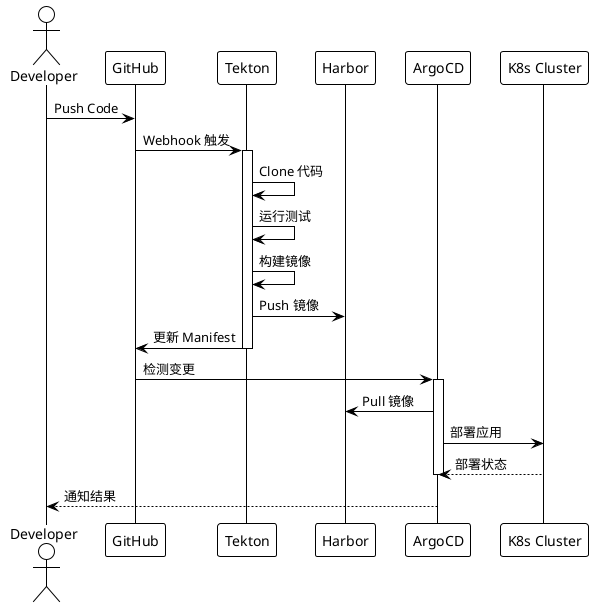

# Kubernetes 实战：从零构建生产级 CI/CD 流水线

在微服务和容器化已成为标配的今天，一套成熟的 CI/CD 流水线是工程效能的核心基础设施。本文将从实际项目出发，详解如何构建一套生产级别的 Kubernetes 原生 CI/CD 系统。

## 架构设计

```
┌─────────────┐     ┌─────────────┐     ┌─────────────┐
│   GitHub    │────▶│   Tekton    │────▶│   Harbor    │
│  (Source)   │     │ (Pipeline)  │     │ (Registry)  │
└─────────────┘     └─────────────┘     └─────────────┘
                           │
                           ▼
                    ┌─────────────┐
                    │   ArgoCD    │
                    │  (GitOps)   │
                    └─────────────┘
                           │
           ┌───────────────┼───────────────┐
           ▼               ▼               ▼
    ┌───────────┐   ┌───────────┐   ┌───────────┐
    │    Dev    │   │  Staging  │   │   Prod    │
    │  Cluster  │   │  Cluster  │   │  Cluster  │
    └───────────┘   └───────────┘   └───────────┘
```

## CI/CD 流水线时序图

下面的时序图展示了一次完整的 CI/CD 流程：



## Tekton Pipeline 配置

### 定义 Task

```yaml
apiVersion: tekton.dev/v1beta1
kind: Task
metadata:
  name: build-and-push
spec:
  params:
    - name: image
      type: string
    - name: dockerfile
      type: string
      default: Dockerfile
  workspaces:
    - name: source
  steps:
    - name: build
      image: gcr.io/kaniko-project/executor:latest
      command:
        - /kaniko/executor
      args:
        - --dockerfile=$(params.dockerfile)
        - --context=$(workspaces.source.path)
        - --destination=$(params.image)
        - --cache=true
        - --cache-ttl=24h
```

### 定义 Pipeline

```yaml
apiVersion: tekton.dev/v1beta1
kind: Pipeline
metadata:
  name: ci-pipeline
spec:
  params:
    - name: repo-url
      type: string
    - name: revision
      type: string
      default: main
    - name: image
      type: string
  workspaces:
    - name: shared-workspace
  tasks:
    - name: fetch-source
      taskRef:
        name: git-clone
      params:
        - name: url
          value: $(params.repo-url)
        - name: revision
          value: $(params.revision)
      workspaces:
        - name: output
          workspace: shared-workspace
          
    - name: run-tests
      taskRef:
        name: run-tests
      runAfter:
        - fetch-source
      workspaces:
        - name: source
          workspace: shared-workspace
          
    - name: build-push
      taskRef:
        name: build-and-push
      runAfter:
        - run-tests
      params:
        - name: image
          value: $(params.image)
      workspaces:
        - name: source
          workspace: shared-workspace
```

## ArgoCD GitOps 配置

### Application 定义

```yaml
apiVersion: argoproj.io/v1alpha1
kind: Application
metadata:
  name: my-app
  namespace: argocd
spec:
  project: default
  source:
    repoURL: https://github.com/org/k8s-manifests
    targetRevision: HEAD
    path: apps/my-app/overlays/production
  destination:
    server: https://kubernetes.default.svc
    namespace: production
  syncPolicy:
    automated:
      prune: true
      selfHeal: true
    syncOptions:
      - CreateNamespace=true
```

### Kustomize 多环境管理

```
apps/my-app/
├── base/
│   ├── deployment.yaml
│   ├── service.yaml
│   └── kustomization.yaml
└── overlays/
    ├── development/
    │   ├── kustomization.yaml
    │   └── replica-patch.yaml
    ├── staging/
    │   ├── kustomization.yaml
    │   └── replica-patch.yaml
    └── production/
        ├── kustomization.yaml
        └── replica-patch.yaml
```

## 安全最佳实践

### 1. 镜像签名与验证

```yaml
apiVersion: policy.sigstore.dev/v1alpha1
kind: ClusterImagePolicy
metadata:
  name: signed-images-only
spec:
  images:
    - glob: "harbor.example.com/**"
  authorities:
    - key:
        data: |
          -----BEGIN PUBLIC KEY-----
          ...
          -----END PUBLIC KEY-----
```

### 2. RBAC 最小权限

```yaml
apiVersion: rbac.authorization.k8s.io/v1
kind: Role
metadata:
  name: tekton-pipeline-role
  namespace: ci
rules:
  - apiGroups: [""]
    resources: ["pods", "pods/log"]
    verbs: ["get", "list", "watch"]
  - apiGroups: ["tekton.dev"]
    resources: ["pipelineruns", "taskruns"]
    verbs: ["get", "list", "create"]
```

### 3. Secrets 管理

使用 External Secrets Operator 与 Vault 集成：

```yaml
apiVersion: external-secrets.io/v1beta1
kind: ExternalSecret
metadata:
  name: docker-registry-secret
spec:
  refreshInterval: 1h
  secretStoreRef:
    name: vault-backend
    kind: ClusterSecretStore
  target:
    name: docker-registry-credentials
  data:
    - secretKey: .dockerconfigjson
      remoteRef:
        key: secret/docker-registry
        property: config
```

## 监控与告警

### Prometheus 指标采集

```yaml
apiVersion: monitoring.coreos.com/v1
kind: ServiceMonitor
metadata:
  name: tekton-pipelines
spec:
  selector:
    matchLabels:
      app: tekton-pipelines-controller
  endpoints:
    - port: metrics
      interval: 30s
```

### 关键指标

| 指标名称 | 含义 | 告警阈值 |
|---------|------|---------|
| `tekton_pipelinerun_duration_seconds` | 流水线执行时长 | > 30min |
| `tekton_pipelinerun_count` | 失败率 | > 10% |
| `argocd_app_sync_total` | 同步失败数 | > 0 |

## 总结

构建生产级 CI/CD 流水线需要综合考虑效率、安全、可观测性等多个维度。Tekton + ArgoCD 的组合提供了声明式、可扩展、Kubernetes 原生的解决方案，是现代云原生团队的优选架构。
