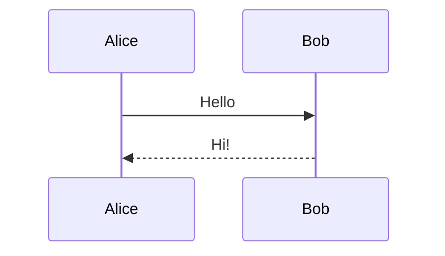
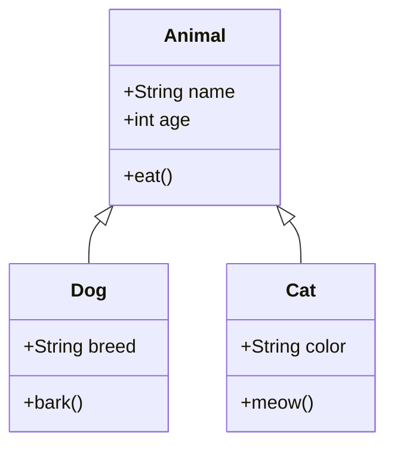
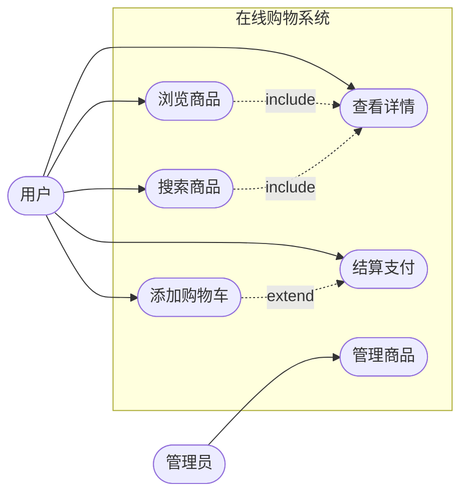

本文用于测试 Mermaid 图表的运行时渲染。构建阶段只保留图表源码，页面加载后由浏览器端的 Mermaid 渲染为 SVG。

## 功能清单

- 浏览器端运行时渲染
- 支持页面切换后重新渲染
- 支持浅色/暗色主题切换后重新渲染
- 语法错误时显示源码降级
- 不依赖远程图表服务器

## 1. 简单时序图

这是一个简单的 Mermaid 时序图。

## 2. 类图

这是一个包含继承关系的类图。

## 3. 中文流程图

这是一个包含中文节点的流程图。

## 测试步骤

1. 刷新页面，确认图表从“渲染图表中...”变成 SVG。
2. 点击右上角主题切换按钮，确认 Mermaid 图表会按当前主题重新渲染。
3. 从其他页面再返回此页，确认图表仍能正常渲染。
4. 临时写入错误 Mermaid 语法时，页面应显示错误提示和原始源码。
