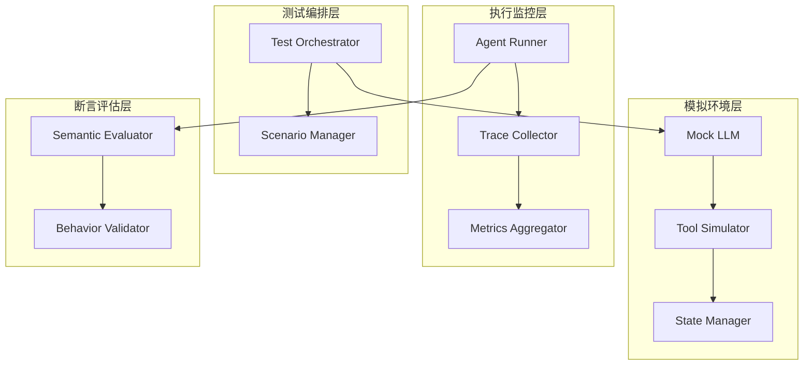
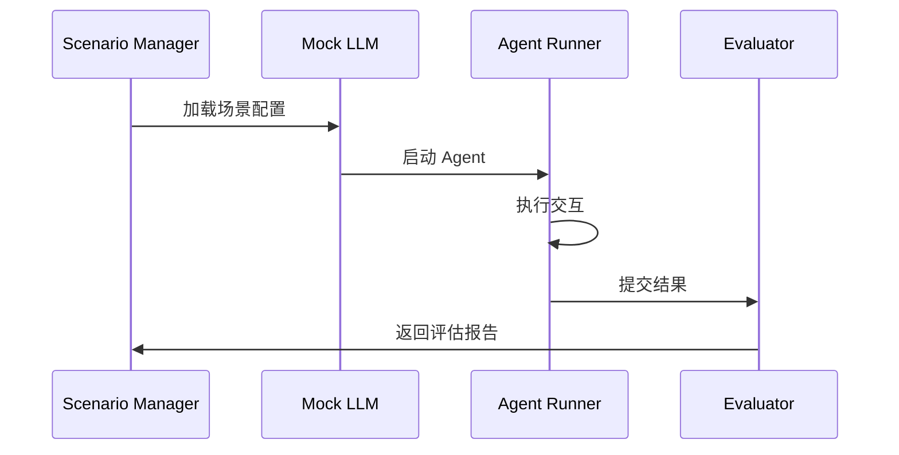

# Assets 资源说明

本目录存放文章相关的静态资源文件。

## 文件列表

| 文件名 | 说明 | 建议尺寸 |
|--------|------|----------|
| `architecture.png` | Multi-Agent 测试架构全景图，展示四层架构设计 | 1400x800 |
| `test-flow.png` | 测试流程图，展示从场景准备到结果评估的完整流程 | 1200x600 |
| `agent-communication.png` | Agent 间通信流程示意图 | 1000x500 |

## Mermaid 源码

### architecture.png

### test-flow.png

