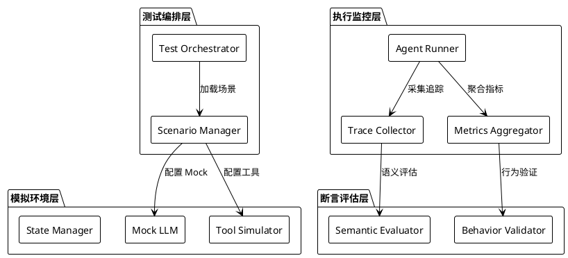

# Multi-Agent 系统自动化测试架构设计


Multi-Agent 系统因其**非确定性**、**状态复杂性**和**交互多样性**，成为了软件测试领域最具挑战性的场景之一。本文将分享我们团队在构建 Multi-Agent 自动化测试架构过程中的实践经验。

## 挑战分析

在开始设计之前，我们首先识别了 Multi-Agent 系统测试的核心挑战：

### 1. 非确定性输出

LLM 驱动的 Agent 即使输入相同，输出也可能不同。这导致传统的"断言精确值"策略失效。

```python
# ❌ 传统断言方式 - 在 Agent 测试中不可行
assert agent.response == "预期的精确字符串"

# ✅ 语义级断言 - 适用于 Agent 测试
assert semantic_similarity(agent.response, expected_intent) > 0.85
```

### 2. 状态空间爆炸

多个 Agent 之间的交互组合呈指数级增长，穷举测试不现实。

### 3. 外部依赖复杂

Agent 通常依赖外部工具、API、数据库，Mock 策略需要精心设计。

## 整体架构设计

下图展示了我们设计的 Multi-Agent 测试架构全景：



整个架构分为四层：

| 层级 | 职责 | 核心组件 |
|------|------|----------|
| 测试编排层 | 管理测试生命周期 | Test Orchestrator, Scenario Manager |
| 模拟环境层 | 提供可控的运行环境 | Mock LLM, Tool Simulator, State Manager |
| 执行监控层 | 执行测试并采集数据 | Agent Runner, Trace Collector, Metrics Aggregator |
| 断言评估层 | 评估测试结果 | Semantic Evaluator, Behavior Validator |

## Agent 间通信测试


Multi-Agent 系统的核心是 Agent 间的通信。我们采用**消息契约测试**来验证通信正确性：

```typescript
// 定义消息契约
interface AgentMessage {
  from: AgentId;
  to: AgentId;
  type: 'request' | 'response' | 'broadcast';
  payload: unknown;
  timestamp: number;
}

// 契约验证器
class MessageContractValidator {
  validate(message: AgentMessage, schema: MessageSchema): ValidationResult {
    // 验证消息结构
    const structureValid = this.validateStructure(message, schema);
    // 验证语义正确性
    const semanticValid = this.validateSemantics(message, schema);
    // 验证时序约束
    const temporalValid = this.validateTemporal(message, schema);
    
    return {
      passed: structureValid && semanticValid && temporalValid,
      details: { structureValid, semanticValid, temporalValid }
    };
  }
}
```

## 测试流程设计


完整的测试流程包括以下步骤：

### 1. 场景准备

```yaml
# scenario.yaml - 场景定义文件
name: "Multi-Agent 协作完成代码审查"
agents:
  - id: reviewer
    role: "Code Reviewer"
    config: ./configs/reviewer.yaml
  - id: author
    role: "Code Author"
    config: ./configs/author.yaml
    
initial_state:
  code_diff: "./fixtures/sample_diff.patch"
  
expected_outcomes:
  - type: "message_sent"
    from: "reviewer"
    contains: ["建议", "问题"]
  - type: "state_change"
    agent: "author"
    field: "acknowledged"
    value: true
```

### 2. Mock LLM 策略

为了实现可复现的测试，我们设计了分层的 Mock 策略：

```python
class MockLLMProvider:
    def __init__(self, strategy: str):
        self.strategy = strategy
        
    def complete(self, prompt: str) -> str:
        if self.strategy == "deterministic":
            # 基于 prompt hash 返回固定响应
            return self.response_cache.get(hash(prompt))
        elif self.strategy == "semantic_match":
            # 基于语义相似度返回最匹配的响应
            return self.find_closest_response(prompt)
        elif self.strategy == "constrained_random":
            # 在约束范围内随机生成
            return self.generate_within_constraints(prompt)
```

### 3. 断言与评估

```python
class AgentBehaviorEvaluator:
    """评估 Agent 行为是否符合预期"""
    
    def evaluate_response_quality(self, response: str, criteria: dict) -> Score:
        scores = {}
        
        # 相关性评估
        scores['relevance'] = self.llm_judge.rate(
            response, 
            criteria['expected_topic'],
            scale=10
        )
        
        # 完整性评估
        scores['completeness'] = self.check_required_elements(
            response, 
            criteria['required_elements']
        )
        
        # 格式合规性
        scores['format'] = self.validate_format(
            response, 
            criteria['format_schema']
        )
        
        return Score(
            overall=sum(scores.values()) / len(scores),
            breakdown=scores
        )
```

## 持续集成集成

我们将测试架构与 CI/CD 流水线深度集成：

```yaml
# .github/workflows/agent-tests.yml
name: Multi-Agent Tests

on: [push, pull_request]

jobs:
  unit-tests:
    runs-on: ubuntu-latest
    steps:
      - uses: actions/checkout@v4
      - name: Run Agent Unit Tests
        run: pytest tests/unit --cov=agents
        
  integration-tests:
    needs: unit-tests
    runs-on: ubuntu-latest
    steps:
      - name: Run Integration Tests
        run: pytest tests/integration --timeout=300
        
  e2e-tests:
    needs: integration-tests
    runs-on: ubuntu-latest
    steps:
      - name: Run E2E Scenarios
        run: python -m agent_test.runner --scenarios=tests/e2e/scenarios/
```

## 关键指标与监控

我们定义了以下关键测试指标：

- **确定性覆盖率**：使用确定性 Mock 可覆盖的场景比例
- **语义一致性分数**：多次运行结果的语义相似度
- **状态收敛时间**：系统达到稳定状态的平均时间
- **异常恢复率**：注入异常后系统正确恢复的比例

## 总结与展望

构建 Multi-Agent 测试架构的核心原则是：

> 接受不确定性，但限制其边界；追求可复现性，但保留灵活性。

随着 Agent 系统的复杂度不断提升，测试方法论也需要持续演进。未来我们计划探索：

1. **基于 Agent 的测试生成**：让 Agent 自己生成测试用例
2. **对抗性测试**：引入红队 Agent 进行安全测试
3. **演化测试**：基于实际运行数据自动优化测试场景

---

*本文的架构图和流程图已放置在 `assets/` 目录下，源文件使用 Mermaid 格式，可自由编辑。*
