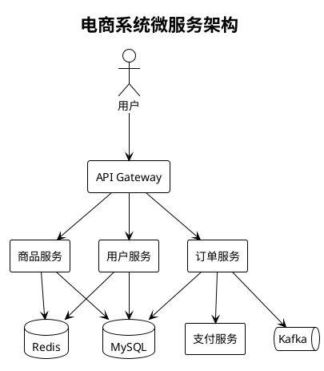

一句话概括 Rosydawn： 一个基于 Astro 进行构建，完全由 AI 设计和开发实现的博客框架。采用 **[OpenSpec](https://github.com/Fission-AI/OpenSpec)** 的 SDD（Spec-Driven Development）规范驱动开发模式，集成了一键部署、自动化部署、HTTPS 等能力。

## 核心特性

| 特性 | 描述 |
|------|------|
| 静态生成 | 基于 Astro SSG，无需服务器 |
| 内容管理 | 使用 Astro Content Collections 管理博客文章，能够通过文件夹的方式组织和管理内容 |
| Markdown/MDX | 支持标准 Markdown 和 MDX 扩展语法 |
| 代码高亮 | 集成 Shiki（支持 light/dark 双主题） |
| 暗黑模式 | 支持系统偏好检测和手动切换，无 FOUC |
| 图表支持 | 集成 PlantUML、Drawio 绘图能力 |
| 响应式设计 | 移动端友好，自适应布局 |
| 组件化 | Header/Footer 统一组件，单一维护点 |
| 自动部署 | 基于 Cron 的 Git 监控与自动构建 |
| HTTPS | Let's Encrypt 证书自动申请与续期 |
| SDD 开发 | 基于 OpenSpec 的规范驱动开发模式 |

## 技术栈

```yaml
框架: Astro 5.17.x
语言: TypeScript
样式: Scoped CSS (无预处理器)
代码高亮: Shiki (内置于 Astro, 支持双主题)
图表: astro-plantuml
部署: Nginx + Let's Encrypt (自动化脚本)
开发模式: OpenSpec SDD (Spec-Driven Development)
```

## OpenSpec SDD 开发模式

本项目采用 [OpenSpec](https://github.com/Fission-AI/OpenSpec) 的规范驱动开发（SDD）模式。这是一种以规范为中心的开发方法论，特别适合与 AI 协作开发。

### 什么是 SDD？

SDD（Spec-Driven Development）将每个功能变更分解为清晰的阶段：

```
Proposal → Specs → Design → Tasks → Implementation → Archive
   ↓         ↓        ↓        ↓          ↓            ↓
  WHY      WHAT      HOW     TODO       CODE        DONE
```

1. **Proposal**：明确变更的动机和范围（为什么要做）
2. **Specs**：定义功能的行为规范（做什么）
3. **Design**：设计实现方案（怎么做）
4. **Tasks**：分解为可执行的任务清单
5. **Implementation**：按规范实现代码
6. **Archive**：归档变更记录，同步规范

### 目录结构

```
openspec/
├── specs/                      # 主规范目录（capability specs）
│   ├── dark-mode/             # 暗黑模式规范
│   │   └── spec.md
│   ├── shared-layout-components/  # 共享布局组件规范
│   │   └── spec.md
│   └── ...
│
└── changes/                    # 变更目录
    └── archive/               # 已归档的变更
        └── 2026-02-09-extract-nav-components/
            ├── proposal.md    # 变更提案
            ├── design.md      # 技术设计
            ├── specs/         # Delta 规范
            └── tasks.md       # 任务清单
```

### 工作流程示例

以「导航组件提取」为例，展示完整的 SDD 工作流程：

**1. 创建变更**
```bash
/opsx:new extract-nav-components
```

**2. 编写 Proposal**（明确动机）
```markdown
## Why
导航菜单代码在 6 个页面文件中完全重复，违反 DRY 原则。

## What Changes
- 创建 Header.astro / Footer.astro 组件
- 更新 Footer 文案添加 OpenSpec 链接
- 修复暗黑模式按钮垂直对齐问题
```

**3. 定义 Specs**（行为规范）
```markdown
### Requirement: Single source of truth
All pages SHALL import and use the shared Header and Footer
components instead of duplicating navigation markup.

#### Scenario: No inline navigation in pages
- **WHEN** examining any page file in `src/pages/`
- **THEN** the page SHALL NOT contain duplicated header/nav markup
- **AND** the page SHALL import and render the Header component
```

**4. 设计 Design**（技术方案）
```markdown
### Decision: 组件放置在 src/components/ 目录
**选择**: Header.astro 和 Footer.astro 放在 src/components/
**理由**: 符合 Astro 项目的标准约定

### Decision: Theme Toggle 对齐修复
**选择**: 在 .nav 容器上添加 align-items: center
**理由**: 根本解决 flexbox 对齐问题
```

**5. 执行 Tasks**
```markdown
- [x] 1.1 创建 Header.astro 文件
- [x] 1.2 创建 Footer.astro 文件
- [x] 2.1 添加 align-items: center 修复对齐
- [x] 4.1-4.6 重构 6 个页面文件
```

**6. 归档 Archive**
```bash
/opsx:archive
# → 同步 delta specs 到主规范
# → 移动到 archive/2026-02-09-extract-nav-components/
```

### SDD 的优势

| 传统开发 | SDD 开发 |
|---------|---------|
| 直接写代码 | 先写规范再实现 |
| 需求在脑中 | 需求在文档中 |
| 修改难追溯 | 完整变更历史 |
| AI 容易偏离 | AI 按规范执行 |

**特别适合 AI 协作开发**：
- 规范作为 AI 的"合约"，减少理解偏差
- 任务清单提供明确的执行路径
- 归档记录便于后续维护和回顾

## 目录结构

```
rosydawn/
├── public/                     # 静态资源
│   ├── favicon.ico
│   └── favicon.svg
│
├── src/
│   ├── components/             # 可复用组件
│   │   ├── Header.astro        # 全局头部（导航 + 主题切换）
│   │   └── Footer.astro        # 全局底部（版权信息）
│   │
│   ├── content/                # 内容目录
│   │   └── posts/              # 博客文章
│   │       └── {year}/{month}/{slug}/
│   │           ├── index.md    # 文章内容
│   │           ├── cover.jpg   # 封面图（可选）
│   │           └── assets/     # 文章资源（可选）
│   │
│   ├── layouts/
│   │   └── Layout.astro        # 全局布局组件
│   │
│   ├── pages/                  # 页面路由
│   │   ├── index.astro         # 首页
│   │   ├── about.astro         # 关于页面
│   │   ├── blog/               # 博客相关
│   │   └── tags/               # 标签相关
│   │
│   └── content.config.ts       # 内容集合配置
│
├── openspec/                   # OpenSpec SDD 目录
│   ├── specs/                  # 主规范
│   └── changes/                # 变更目录
│
├── scripts/
│   ├── deploy.mjs              # 部署脚本入口
│   └── lib/                    # 部署脚本模块
│
├── logs/                       # 日志目录
└── README.md                   # 项目文档
```

## 文章编写规范

### 文件结构

每篇文章存放在独立目录中，按年月组织：

```
src/content/posts/2026/02/my-article/
├── index.md          # 文章内容
├── cover.jpg         # 封面图（可选）
└── assets/           # 文章资源目录（可选）
    ├── diagram.png
    └── screenshot.jpg
```

### Frontmatter 格式

```yaml
---
title: "文章标题"
date: 2026-02-08
description: "一句话描述，会显示在列表页"
tags: ["标签1", "标签2"]
coverImage: ./cover.jpg  # 可选
---
```

### 图表内嵌
#### PlantUML内嵌：
语法如下，指定代码块的语言为 plantuml，并使用 `@startuml` 和 `@enduml` 标记代码块。


#### Drawio内嵌：
Drawio 是通过 svg 内嵌实现的，如果你要使用 drawio，需要按照下列步骤进行：

1、文档需要指定格式为 MDX，即文件命名为`xxx.mdx`

2、在本地将 drawio 导出为 svg 格式，并将 svg 文件命名为 `xxx.drawio.svg`

3、在文档中使用 `?raw` 内嵌 svg：
```mdx
import deploySvg from './assets/deploy-flow.svg?raw';

<div class="drawio-container" set:html={deploySvg} />
```

import deploySvg from './assets/deployment-flow.svg?raw';

<div class="drawio-container" set:html={deploySvg} />


## 部署系统

Rosydawn 提供了完整的自动化部署能力，基于 Node.js 实现。

### 基础命令

```bash
# 一键构建部署（HTTP）
npm run deploy

# 启用 HTTPS
# 更改配置文件中的 `SSL_EMAIL` 变量，并运行以下命令即可完成 SSL 配置
npm run deploy:ssl

# 查看部署状态
npm run deploy:status
```

### 自动部署 (Cron)

脚本支持基于系统 Cron 的自动部署，定时检查 Git 仓库更新并自动构建部署：

```bash
# 安装 Cron 任务
# 定时任务配置在 scripts/deploy.mjs 文件中
npm run deploy:cron:install

# 查看状态
npm run deploy:cron:status

# 查看实时日志
tail -f logs/deploy.log
```

#### 工作原理

1. **Cron 定时触发** - 系统 Cron 每 N 分钟调用脚本
2. **Git 检查** - 比较本地和远程 commit hash
3. **自动拉取** - 检测到更新后执行 `git pull`
4. **构建部署** - 自动执行构建和部署流程
5. **邮件通知** - 部署完成后发送邮件通知（可选）

#### Cron 环境兼容性

脚本针对 Cron 的特殊环境做了以下适配：

| 问题 | 解决方案 |
|------|----------|
| PATH 环境变量精简 | 脚本启动时自动将当前 Node.js 的 bin 目录添加到 PATH |
| USER 环境变量缺失 | 使用 `id -un` 系统命令获取用户名 |
| SSH Agent 不可用 | 自动检测 SSH key 并通过 `GIT_SSH_COMMAND` 注入 |
| 日志目录不存在 | 写入日志前自动创建 `logs/` 目录 |

### SSL 证书管理

```bash
# 首次安装证书
# 更改配置文件中的 `SSL_EMAIL` 变量， 用于接收 Let-Encrypt 的信息，运行以下命令即可完成 SSL 配置
npm run deploy:ssl
# 手动续期
npm run deploy:renew

# 查看证书状态
npm run deploy:status
```

Let's Encrypt 证书有效期为 90 天，Certbot 会自动设置续期任务。

## 性能优化

### 前端优化

| 优化项 | 实现方式 | 效果 |
|--------|----------|------|
| 零字体请求 | 使用系统原生字体栈 | 首屏渲染无阻塞 |
| 单一 Favicon | 仅使用 SVG 格式 | 减少网络请求 |
| 静态生成 | Astro SSG 预渲染 | 无服务端渲染开销 |

### Nginx 服务端优化

部署脚本自动配置以下性能优化：

```nginx
# 零拷贝传输
sendfile on;
tcp_nopush on;
tcp_nodelay on;

# Gzip 压缩
gzip on;
gzip_comp_level 5;
gzip_types text/plain text/css application/json application/javascript;

# 静态资源长期缓存
location ~* \.(css|js|woff2)$ {
    expires 1y;
    add_header Cache-Control "public, immutable";
}
```

## 代码块增强

文章详情页对代码块做了以下增强：

1. **语言标签显示** - 代码块右上角显示语言名称
2. **行号显示** - 等宽对齐的行号
3. **复制按钮** - 一键复制代码内容
4. **展开/收起** - 超过 15 行时自动折叠
5. **滚动位置补偿** - 防止展开/收起时页面跳动

```javascript
// 展开/收起时的滚动补偿
const rectBefore = wrapper.getBoundingClientRect();
const topBefore = rectBefore.top;

wrapper.classList.toggle('collapsed');

const rectAfter = wrapper.getBoundingClientRect();
const scrollDiff = rectAfter.top - topBefore;
if (scrollDiff !== 0) {
  window.scrollBy(0, scrollDiff);
}
```

## 开发注意事项
重要❗：开发前把这段提示词发给你的大模型工具：
```text
这是 rosydawn 个人博客项目，采用 OpenSpec SDD 开发模式。

## 开始前
请阅读 README.md，其中包含：
- 项目架构与技术栈（Astro 5 + TypeScript）
- OpenSpec SDD 开发规范
- 部署流程（Git 驱动 + Cron 监控）
- AI 协作专属指南

## OpenSpec SDD
功能变更请使用 OpenSpec 工作流：
- /opsx:new <name> - 创建新变更
- /opsx:continue - 创建下一个 artifact
- /opsx:apply - 实现任务
- /opsx:archive - 归档变更

## 限制
- 不要读取 src/content/**/*.md 文件（博客文章）
- 不要读取 public/images/ 下的资源文件

## 关注范围
- src/components/ - 组件开发
- src/layouts/ - 布局模板
- src/pages/ - 页面路由
- openspec/ - 规范文档
- scripts/lib/ - 部署脚本
- astro.config.mjs - 构建配置
```

## 快速开始

```bash
# fork 本项目并克隆项目到本地
cd rosydawn

# 安装依赖
npm install

# 开发模式
npm run dev

# 服务端部署
npm run deploy

# 查看部署帮助信息
npm run deploy:help
```
