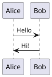
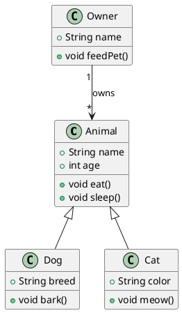
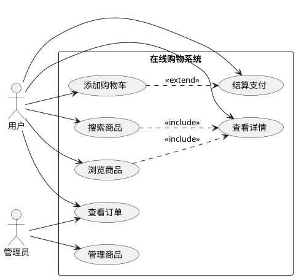
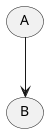
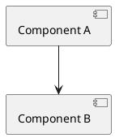

# PlantUML 加载状态测试

本文用于测试 PlantUML 图片的加载状态管理功能，包括：
- Loading 动画显示
- 加载失败错误提示
- 重试按钮功能
- 超时处理
- 暗色模式兼容性

## 1. 简单的 PlantUML 图表（快速加载）

这是一个简单的时序图，应该能快速加载完成。



## 2. 中等复杂度的图表

这是一个包含更多元素的类图，加载时间会稍长一些。



## 3. 复杂的图表（慢速加载）

这是一个包含中文注释的复杂用例图，加载可能需要更长时间。



## 4. 多图表场景

下面有三个并排显示的简单图表，用于测试多图片独立加载。





```plantuml
@startuml
state S1 --> S2
@enduml
```

## 5. 测试场景说明

### Loading 状态测试
1. 刷新页面，观察上面的图表
2. 应该看到旋转的 spinner 动画
3. 图表加载完成后，spinner 消失，图片显示

### Error 状态测试（需要手动触发）
1. 打开 Chrome DevTools (F12)
2. 进入 Network 标签
3. 选择 "Offline" 模式
4. 刷新页面
5. 应该看到错误图标和提示文字
6. 点击"重新加载"按钮
7. 恢复网络后，图片应该正常加载

### 超时测试（需要慢速网络）
1. 打开 Chrome DevTools (F12)
2. 进入 Network 标签
3. 选择 "Slow 3G" 或自定义延迟 > 30秒
4. 刷新页面
5. 等待 30 秒后应该看到超时错误

### 暗色模式测试
1. 点击页面右上角的主题切换按钮
2. 切换到暗色模式
3. 观察 loading 动画、错误提示和图片显示
4. 验证所有状态下视觉清晰

### View Transitions 测试
1. 点击导航链接到其他页面
2. 再点击返回此页面
3. 验证 PlantUML 图片重新加载
4. 功能应该正常工作

## 6. 功能验证清单

- [ ] Loading 动画显示正常
- [ ] 图表加载成功后正常显示
- [ ] 图片/源码切换按钮正常工作
- [ ] 网络错误时显示错误提示
- [ ] 重试按钮可点击
- [ ] 重试按钮 2 秒内不可重复点击
- [ ] 超时后显示错误提示
- [ ] 暗色模式下所有状态清晰可见
- [ ] 页面导航后功能正常
- [ ] 多图片独立加载和管理

## 预期行为

### 正常加载流程
1. 页面加载时立即显示 loading 动画（旋转 spinner）
2. 图片在后台加载
3. 加载成功：spinner 消失，图片显示
4. 鼠标悬停时，右上角显示"查看源码"按钮

### 失败处理流程
1. 加载失败时显示错误状态
2. 错误图标（感叹号圆圈）
3. 提示文字："图片加载失败，请检查网络连接后重试"
4. "重新加载"按钮
5. 点击按钮后重新尝试加载

### 性能指标
- **零额外请求** - 纯 CSS 动画，无额外资源
- **超时时间** - 30 秒
- **防抖时间** - 2 秒（重试按钮）
- **内存管理** - 页面切换时自动清理

---

如果你能看到所有图表正常显示，并且可以切换到源码视图，说明功能正常工作！✨
