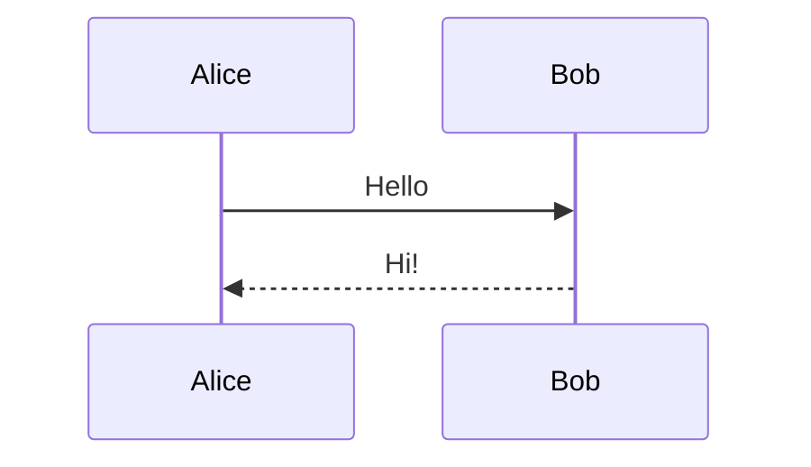
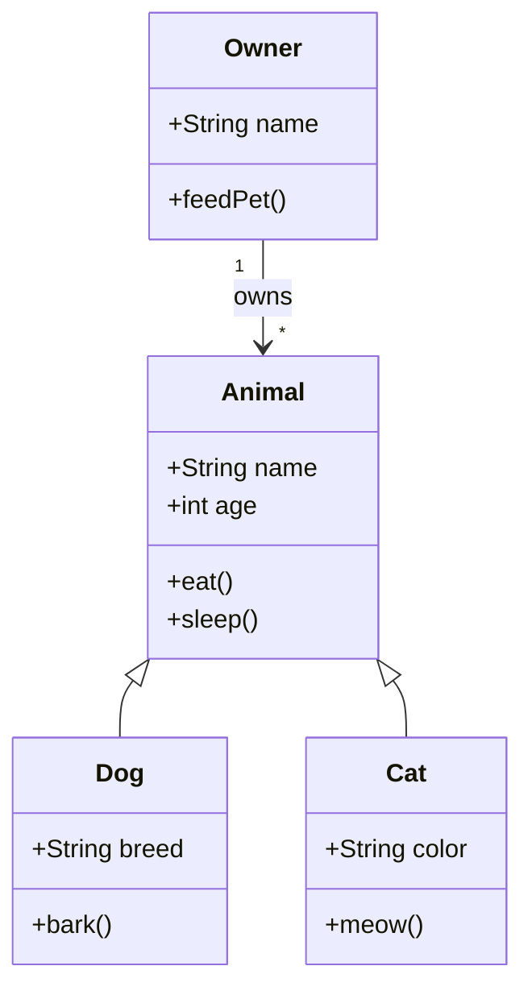
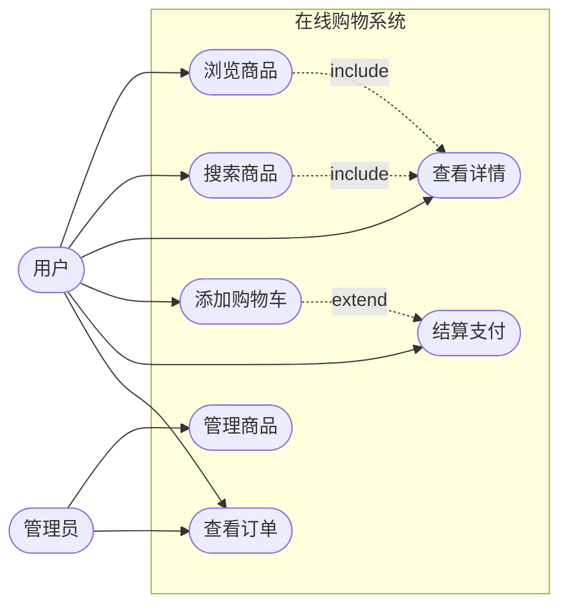
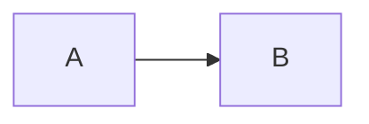
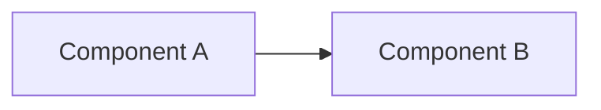
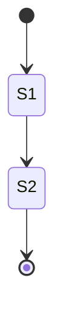

# Mermaid 运行时渲染测试

本文用于测试 Mermaid 图表的运行时渲染能力。站点构建时不会请求外部图表服务，页面加载后由浏览器端 Mermaid 将源码渲染为 SVG。

## 1. 简单时序图

```mermaid
sequenceDiagram
  participant Alice
  participant Bob
  Alice->>Bob: Hello
  Bob-->>Alice: Hi!
```

## 2. 类图

```mermaid
classDiagram
  class Animal {
    +String name
    +int age
    +eat()
    +sleep()
  }

  class Dog {
    +String breed
    +bark()
  }

  class Cat {
    +String color
    +meow()
  }

  class Owner {
    +String name
    +feedPet()
  }

  Animal <|-- Dog
  Animal <|-- Cat
  Owner "1" --> "*" Animal : owns
```

## 3. 中文业务流程图

```mermaid
flowchart LR
  User([用户])
  Admin([管理员])

  subgraph Shop[在线购物系统]
    UC1([浏览商品])
    UC2([搜索商品])
    UC3([查看详情])
    UC4([添加购物车])
    UC5([结算支付])
    UC6([管理商品])
    UC7([查看订单])
  end

  User --> UC1
  User --> UC2
  User --> UC3
  User --> UC4
  User --> UC5
  User --> UC7

  Admin --> UC6
  Admin --> UC7

  UC1 -. include .-> UC3
  UC2 -. include .-> UC3
  UC4 -. extend .-> UC5
```

## 4. 多图表场景

```mermaid
flowchart LR
  A --> B
```

```mermaid
flowchart LR
  ComponentA[Component A] --> ComponentB[Component B]
```

```mermaid
stateDiagram-v2
  [*] --> S1
  S1 --> S2
  S2 --> [*]
```

## 5. 验证清单

- 图表会在浏览器端渲染成 SVG
- 多个图表可以独立渲染
- 页面导航后图表可以重新渲染
- 暗色模式切换后图表主题会刷新
- 不再请求外部图表服务器
