在最开始接触到 SDD 的时候，我了解到社区里主要有两种方案：Spec Kit 和 OpenSpec。当时选择 OpenSpec 来实践 SDD 的原因非常简单：我个人不太喜欢 Spec Kit 整出的那一大堆命令和概念；而与之相比，OpenSpec 足够简单，早期通过三个命令串联起整个 SDD 工作流程，看起来更有让人真正用起来的吸引力。

当时 OpenSpec 还是 0.x 版本，我尝试用 OpenSpec + CodeMaker 的方式复刻了之前的两个需求，体验了整个 SDD 工作流程。后来我也用 OpenSpec 实际做过一些需求开发。结合当时的实践，以及过去对 Vibe Coding 的体验来看，我一直认为 0.x 版本的 OpenSpec 还不是我心目中的答案。它能把 SDD 的基本流程跑起来，但极难在大规模工程中落地。

在年前，OpenSpec 从 0.x 到 1.x 的演进非常明显，于是我萌生了一个想法：假期里用自己的项目深度体验和剖析 OpenSpec 1.x，看看它到底解决了什么问题，又留下了哪些新的问题。

## 从 0.x 到 1.x 的核心变化

OpenSpec 从 0.x 到 1.x，最主要的变化可以概括为四点：工作流调整、命令系统扩展、引入 Skill 能力，以及落地结构调整。

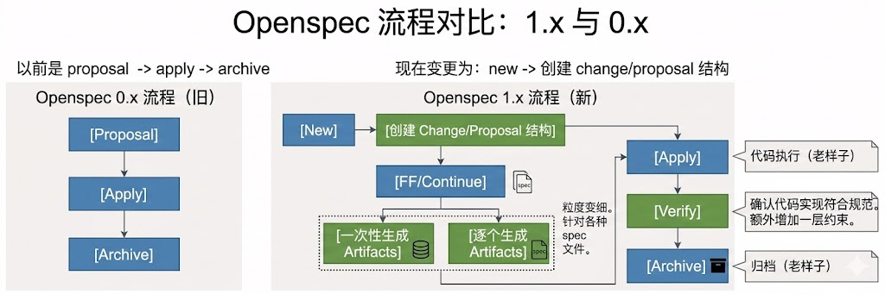

### 工作流调整

核心调整是从过去的一波流，转变为更细粒度的 step。针对每一个 step，都有对应的 artifact 生成。在这个过程中，人可以进入 review，对产物生成结果进行干预，并即时调整产物内容。在完成所有产物生成工作之后，再执行 apply 进行代码实现。

同时，在需求归档之前，OpenSpec 1.x 增加了额外的校验约束节点，用于对归档需求进行质量把关。主要校验包括三类：

| 校验类型 | 关注点 |
| --- | --- |
| 需求完整性校验 | `tasks.md` 中的 todo 项是否都标记为已完成；需求对应的所有 spec 是否都已经实现完毕。 |
| 需求正确性校验 | 结合具体 spec 和代码，再次校验需求意图与场景是否正确落到代码实现上。 |
| 需求一致性校验 | 结合 `design.md` 和全局约束，校验需求实现是否符合先前设计以及项目整体公约。 |

这套流程相比过去更加繁琐，但它带来了更高的 SDD 落地可能性。它本质上是在要求工程师建立一套“先思考、再定义、后实施、必校验”的工作节奏。无论是整体流程，还是每一个产物生成环节，人都有机会参与判断，而不是把全部希望押在模型一次性生成正确结果上。

### 命令系统扩展

OpenSpec 0.x 的命令系统非常克制，核心只有三个命令。

| 命令 | 名称 | 功能 |
| --- | --- | --- |
| `/openspec:proposal` | 创建新需求 | 创建一个新的变更提案和临时目录 `changes`，AI 在此阶段协助生成和验证 spec。 |
| `/openspec:apply` | 批准需求实施 | 将已批准提案中的 spec 实施到代码中。AI 根据 spec 描述生成或修改代码。 |
| `/openspec:archive` | 归档需求 | 变更实施完成后，将提案目录中的 spec 更新到主 spec 库 `openspec/specs/` 中，并删除或归档临时变更目录。 |

1.x 的 OPSX 命令系统扩展到了 10 个命令：

| 命令 | 名称 | 功能 |
| --- | --- | --- |
| `/opsx:explore` | 探索需求 | 通过人和模型多轮对话，不断思考问题，并结合已有代码库等信息，把模糊需求澄清完整。 |
| `/opsx:new` | 创建新需求 | 创建新的 change，逐步构建 artifacts。 |
| `/opsx:ff` | 快速创建所有产物 | 快速创建 change，并一次性生成所有 artifacts。 |
| `/opsx:continue` | 继续下一个阶段 | 继续 change 工作，创建下一个 artifact。 |
| `/opsx:apply` | 批准需求实施 | 实现 change 中的任务。 |
| `/opsx:verify` | 校验需求是否已完成 | 验证实现是否与 change artifacts 匹配。 |
| `/opsx:sync` | 同步规格 | 将 delta specs 同步到 main specs。 |
| `/opsx:archive` | 归档需求 | 归档已完成的 change。 |
| `/opsx:bulk-archive` | 批量归档需求 | 批量归档多个已完成的 changes。 |
| `/opsx:onboard` | 教程模式 | 引导式入门教程，演示完整 workflow。 |

结合过去对 0.x 的使用体验，我感觉 OpenSpec 命令演进的核心，是把 0.x 的一波流拆成每一步都可干预的渐进式流程。它变复杂了，但复杂得有意义：人的判断力开始被放回流程中。

### 引入 Skill 能力

过去需要通过命令的方式调用 OpenSpec 驱动研发过程。现在可以通过和模型的纯对话触发对应 Skill 来完成相应流程。同时，引入 Skill 后，相关技能模块能够按需加载，不再是过去那种一股脑把所有提示词灌给大模型的方式。

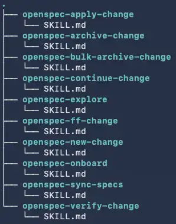

在一个初始化后的项目里，可以看到类似下面这样的 Skill 目录：

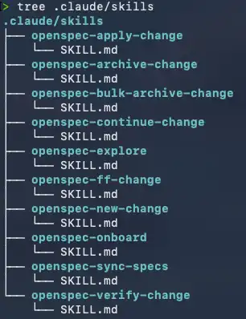

从工程实践看，Skill 化的意义不只是“命令换了一层包装”。更重要的是，它把任务上下文拆成了更小的能力模块：什么时候该 explore，什么时候该 continue，什么时候该 verify，模型可以按需加载对应指令，而不是在同一个巨大的 prompt 中被大量无关规则稀释注意力。

### 落地结构调整

0.x 中原有的 `agents.md`、`openspec/agents.md`、`openspec/project.md` 被移除，取而代之的是 `openspec/config.yaml` 与 Skill 体系。

| 移除的 0.x 文件 | 描述 | 取而代之的 1.x 结构 | 新结构描述 |
| --- | --- | --- | --- |
| `agents.md` | 位于项目根目录，存放通用 AI 智能体行为守则。 | Skills 承接 | 0.x 的 `agents.md` 内容过于宽泛且是被动读取。1.x 将这些指令分散到各个 Skill 模块内部，实现按需加载。 |
| `openspec/agents.md` | 位于 `openspec/` 目录，专门存放与 OpenSpec 工作流相关的 AI 指令，如规范定义、Slash Command 映射。 | `openspec/config.yaml` | YAML 配置文件，包含 schema、context、rules 等结构化配置。 |
| `openspec/project.md` | 项目的全局上下文，例如 tech stack、conventions，是自由格式 Markdown。 | `openspec/config.yaml` 中的 `context` 字段 | 0.x 的 `project.md` 是被动读取；1.x 将其结构化为 `context` 字段，并在每次 AI 请求时主动注入，保证一致性。 |

`openspec/config.yaml` 里比较关键的字段包括：

```yaml
schema: spec-driven

context: |
  语言：中文（简体）
  技术栈：Astro、TypeScript、Node.js
  所有产物必须使用中文撰写。

rules:
  proposal:
    - 提案内容控制在 1-2 页以内。
  specs:
    - 每个 Requirement 必须至少包含一个 Scenario。
```

这个变化让项目公约从散落的自然语言文档，变成了更容易被 OpenSpec 主动注入的结构化上下文。

## OPSX 核心思想与工作流

OpenSpec 把软件的迭代演进视为持续演进的“活文档”。落到具体内容上，就是 spec 文档的迭代更新。它通过 delta 机制，在已有系统上安全地提议、验证和归档行为变更，同时保持完整的审计追踪。

### OpenSpec 的设计思想

OpenSpec 的工具设计遵循几项基本原则。

**灵活而非僵化。** 相比之前的版本，传统规范系统容易把研发流程锁死为“先规划，再实施，然后完成”。OpenSpec 1.x 更加灵活，可以按照个人工作需求，以任何顺序推进 SDD 流程。

**迭代而非瀑布。** 需求会变化，人对需求的理解也会随着思考不断加深。开始时看似不错的方法，在查看代码库后可能不再适用。OpenSpec 基于敏捷迭代流程，而不是瀑布式流程，更适合这种现实。

**简单而非复杂。** OpenSpec 要求自己保持足够简单，不在框架层面做过多设置、严格格式或重量级流程。例如，OpenSpec 并不认为自动化测试必须被包括进它的核心流程中。代码完成后，你可以通过别的流程机制完成测试和修正，但这部分并不是 OpenSpec 的职责范围。

**棕地优先。** 大多数软件工作不是从零开始构建，而是修改现有系统。OpenSpec 基于增量 spec 的方法，使得指定对现有行为的更改变得容易。在开始一个需求之前，它不会要求你先完整描述整个系统；你只需要描述这一次要改变什么。

### 物理隔离

除了 delta 机制让你不用从零开始写完整系统规格，OpenSpec 还通过物理目录隔离来降低并行变更之间的干扰。

```text
openspec/
├── specs/                       # 已有系统的行为描述，可以逐步补充
│   └── auth/
│       └── spec.md
└── changes/                     # 对已有系统的提议修改
    ├── add-2fa/
    │   └── specs/auth/spec.md   # delta，不是完整 spec
    └── fix-login-bug/
        └── specs/auth/spec.md   # 另一个 delta，可并行
```

这里的物理隔离是指每一个 spec、change 都在自己的文件夹里。多人协作时，可以同时修 bug、加功能、做重构。只要多个并行任务之间不存在依赖关系，它们就可以互不干扰地推进。

### 渐进式 Spec 演进

OpenSpec 不需要“大爆炸”式地一次性定义整个系统。spec 会随着项目迭代逐步完善，甚至最后自然生长出对整个系统的完整定义。

```text
归档前：
  specs/auth/spec.md 描述旧行为

归档时：
  delta 中 ADDED 追加
  MODIFIED 替换
  REMOVED 删除

归档后：
  specs/auth/spec.md 描述新行为
  changes/archive/2025-01-24-add-2fa/ 保留完整上下文
```

完整归档机制非常关键。每次对 change 进行归档，不仅会保留 change 记录，还会将更新后的 spec 同步回项目主 spec。归档历史保留了每次“为什么改”（proposal）和“改了什么”（delta）的完整上下文，这可以成为后续系统迭代的重要输入。

## OPSX 默认工作流核心环节分析

OPSX 是 OpenSpec 为了应对旧版工作流问题而引入的新流程。这套流程是可编排的，不再像过去一样难以适应真实开发场景里的灵活需求。

旧版本的流程非常线性：

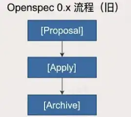

这个工作流在实际落地上存在一些问题：

- 指令硬编码在 OpenSpec 本身的 TypeScript 中，无法修改。
- 一次性创建所有产物，人工无法及时干预，产物无法单独校验和测试。
- 旧版产物结构固定，不可定制。
- AI 输出不好时，无法调整 prompt。

可以简单理解为，OPSX 将这些能力开放了出来。你可以通过自定义 workflow schema，实现更契合业务场景的 SDD 落地规范和流程。

### 默认工作流 DAG

默认工作流大致如下：

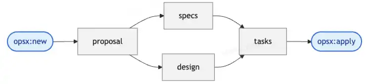

在 OpenSpec 中，产物被称为 artifacts。它们其实就是每一次需求实现过程中生成的几个 Markdown 文档。

一个 artifact 通常包含如下属性：

```yaml
- id: proposal
  generates: proposal.md
  description: Initial proposal document outlining the change
  template: proposal.md
  instruction: >
    xxxxxxxx
  requires: []
```

字段含义大致如下：

| 字段 | 含义 |
| --- | --- |
| `id` | 产物唯一 ID，需要在整个工作流中唯一。 |
| `generates` | 规定 AI 生成的产物文件名。 |
| `description` | 对该文件的简短描述。 |
| `template` | 指向生成该文档时参考的模板文件。 |
| `instruction` | 核心指令，告诉 AI 如何思考并撰写该文档。 |
| `requires` | 前置依赖节点，OpenSpec 依赖它构建工作流有向无环图。 |

### Proposal 提案阶段

Proposal 的核心，是从顶层定义需求：为什么要产生此次变更，以及从顶层视角确定要做什么变更。

```yaml
- id: proposal
  generates: proposal.md
  description: Initial proposal document outlining the change
  template: proposal.md
  instruction: >
    创建具体产物的提示词指令
  requires: []
```

指令的核心是告诉 AI：创建一个提案文档，说明为什么需要发生本次变更。总体来看，提案文档需要包含如下章节：

| 章节 | 要求与目的 |
| --- | --- |
| Why | 仅限 1-2 句话，用于说明现在遇到的问题、本次变更要解决什么问题，以及为什么现在要执行。 |
| What Changes | 列出具体的功能增删。如果是破坏性变更，必须加粗标注 BREAKING。 |
| Capabilities | 定义哪些规格会被创建或修改。New Capabilities 对应新的 `specs/<name>/spec.md`；Modified Capabilities 列出现有能力的规范级行为变化。 |
| Impact | 识别受影响的代码、API、依赖项或系统。 |
| Important | 强调每一个能力必须对应一个 spec 文件；生成前要研究已有规范；保持提案简洁；关注“为什么”而不是“怎么做”。 |

模板内容大致如下：

```markdown
## Why
<!-- Explain the motivation for this change. What problem does this solve? Why now? -->

## What Changes
<!-- Describe what will change. Be specific about new capabilities, modifications, or removals. -->

## Capabilities

### New Capabilities
<!-- Capabilities being introduced. Replace <name> with kebab-case identifier. -->
- `<name>`: <brief description of what this capability covers>

### Modified Capabilities
<!-- Existing capabilities whose REQUIREMENTS are changing, not just implementation. -->
- `<existing-name>`: <what requirement is changing>

## Impact
<!-- Affected code, APIs, dependencies, systems -->
```

实际查看指令时，可以看到 OpenSpec 会把 schema、context、rules、template、dependencies 等信息一起组织给模型。

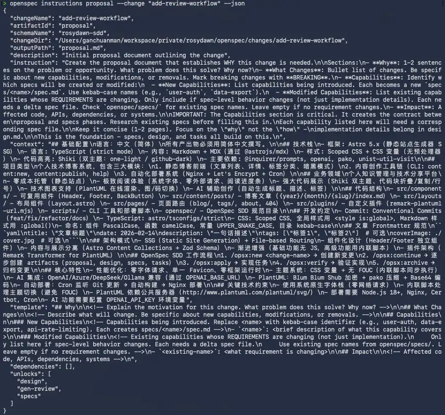

### Specs 规格确定阶段

如果说 proposal 是从顶层视角看待变更产生的原因以及变更内容，那么 specs 则是从具体变更内容出发，严格定义系统应该做什么。这一步会将 proposal 中模糊的描述转化为详细行为定义。

```yaml
- id: specs
  generates: specs/**/*.md
  description: Detailed specifications for the change
  template: spec.md
  instruction: >
    创建具体产物的提示词指令
  requires:
    - proposal
```

这一环节指令的核心是创建规范文件，定义系统“应该做什么”。

| 章节 | 要求与目的 |
| --- | --- |
| 核心映射 | 严格执行 proposal 中的 capability 清单：一个 capability 对应一个 Markdown 规范文件。 |
| 增量操作 | 使用二级标题分类变更：`ADDED`、`MODIFIED`、`REMOVED`、`RENAMED`。 |
| 语法规范 | 使用 `### Requirement: <名称>` 定义需求；使用 SHALL 或 MUST，避免模糊词汇。 |
| 场景定义 | 使用 `#### Scenario: <名称>` 配合 WHEN/THEN 结构；场景必须使用且仅使用 4 个井号。 |
| 修改流 | 修改现有需求时，必须定位到原文件并完整复制整个需求块再编辑，严禁只写部分内容。 |
| Important | 场景标记必须精确，否则解析器可能静默失败；每个 Requirement 必须至少有一个 Scenario；MODIFIED 不完整会导致旧细节丢失。 |

这是 SDD 中最需要人工严守质量的阶段。spec 一旦写偏，后面所有实现都会沿着错误方向继续扩大。

### Design 方案设计阶段

有了清晰的需求定义，design 阶段回答的是“怎么做”。它让模型从技术视角出发，给出实现方案的关键技术决策与架构设计。

```yaml
- id: design
  generates: design.md
  description: Technical design document with implementation details
  template: design.md
  instruction: >
    创建具体产物的提示词指令
  requires:
    - proposal
```

这一环节的重点不是写伪代码，而是说明技术路径、关键取舍和风险。

| 章节 | 要求与目的 |
| --- | --- |
| When to include | 判断什么时候需要创建 `design.md`。跨模块、外部依赖、数据模型变化、安全性能迁移复杂性、技术歧义等场景通常需要 design。 |
| Context | 描述当前系统现状、约束条件和相关利益方，建立技术共识。 |
| Goals / Non-Goals | 明确目标与非目标，防止设计范围膨胀。 |
| Decisions | 列出关键技术决策、决策理由、替代方案及放弃原因。 |
| Risks / Trade-offs | 用“风险 -> 缓解策略”的形式识别技术风险和权衡取舍。 |
| Migration Plan | 涉及数据迁移、API 变更或服务切换时，描述部署步骤和回滚策略。 |
| Open Questions | 列出尚未解决的技术疑问，避免模型强行编造答案。 |
| Important | 必须引用 proposal 和 specs，保持文档间溯源链；design 不是必须产物，避免无价值模板化内容。 |

### Tasks 任务规划阶段

如果说 design 回答了“怎么做”，那么 tasks 则是将“怎么做”拆解为可执行、可追踪的最小工作单元。后续 agent 会根据这份 todo list 逐步完成需求。

```yaml
- id: tasks
  generates: tasks.md
  description: Implementation checklist with trackable tasks
  template: tasks.md
  instruction: >
    创建具体产物的提示词指令
  requires:
    - specs
    - design
```

这一环节最重要的是格式和可执行性。

| 章节 | 要求与目的 |
| --- | --- |
| Format Compliance | 必须严格使用 `- [ ] X.Y 任务描述` 格式。apply 阶段会解析 checkbox 追踪进度，格式错误等于任务丢失。 |
| Grouping | 使用 `## 编号. 分组名称` 对相关任务分组。 |
| Numbering | 采用 `X.Y` 两级编号，确保每个任务有唯一标识。 |
| Granularity | 每个任务应足够小，最好能在一次会话中完成。 |
| Dependency Ordering | 任务应按照依赖关系排列，从上到下能顺序执行。 |
| Verifiability | 每个任务必须可验证，完成时能明确判断“已完成”。 |
| Traceability | 任务应能追溯到某个 spec requirement 或 design decision。 |

模板大致如下：

```markdown
## 1. <!-- Task Group Name -->

- [ ] 1.1 <!-- Task description -->
- [ ] 1.2 <!-- Task description -->

## 2. <!-- Task Group Name -->

- [ ] 2.1 <!-- Task description -->
- [ ] 2.2 <!-- Task description -->
```

### 四个阶段的流转关系

默认工作流可以总结成这样：

```text
proposal (为什么)
   |
   |----> specs  (做什么)
   |----> design (怎么做)
              |
           tasks (做哪些)
              |
            apply (执行)
```

| 阶段 | 核心问题 | 产物 | 前置依赖 |
| --- | --- | --- | --- |
| proposal | Why，为什么要变更？ | `proposal.md` | 无 |
| specs | What，系统应该做什么？ | `specs/**/*.md` | `proposal.md` |
| design | How，技术上怎么实现？ | `design.md` | `proposal.md` |
| tasks | Do，具体做哪些工作？ | `tasks.md` | `specs`、`design` |
| apply | Execute，逐项执行 | 代码变更 | `tasks` |

默认工作流分成四个阶段，每个阶段的产物都是下一个阶段的输入，形成了一条从动机到执行的完整可追溯链路。

## OPSX 工具系统

这一小节的核心目的，是通过对 OPSX 命令行以及 Skills 的分析，理解 OpenSpec 是如何让大模型完成整个工作流程的。

### 命令行系统

命令行可以简单理解为一段提示词的快捷方式。OPSX 提供的 10 个命令如下：

| 命令 | 功能 |
| --- | --- |
| `/opsx:explore` | 进入探索模式，思考问题、调查代码、澄清需求。 |
| `/opsx:new` | 创建新的 change，逐步构建 artifacts。 |
| `/opsx:ff` | 快速创建 change，并一次性生成所有 artifacts。 |
| `/opsx:continue` | 继续 change 工作，创建下一个 artifact。 |
| `/opsx:apply` | 实现 change 中的任务。 |
| `/opsx:verify` | 验证实现是否与 change artifacts 匹配。 |
| `/opsx:sync` | 将 delta specs 同步到 main specs。 |
| `/opsx:archive` | 归档已完成的 change。 |
| `/opsx:bulk-archive` | 批量归档多个已完成的 changes。 |
| `/opsx:onboard` | 引导式入门教程，演示完整 workflow。 |

下面摘出几个比较重要的命令分析。

### Explore

`explore` 进入自由探索模式。在这个模式里，模型会作为用户的思考伙伴，帮助用户探索想法、理清需求。它并不是 OPSX 工作流中的正式阶段，而是一个辅助工具，可以用来无压力探索和项目相关的问题。

`explore` 有几个重要约束：

- 严格的“不实现”规则：只读文件、搜索代码，绝不写应用代码。
- 唯一例外：当 explore 探索完毕，可以基于探索结果为用户创建新的 change。
- OpenSpec 上下文感知：如果存在活跃变更，会自动读取相关 artifact 作为讨论背景。
- 自然过渡：当想法成熟时，提议过渡到 `/opsx:new` 或 `/opsx:ff`。
- 鼓励可视化：探索过程会大量使用 ASCII 图表辅助思考。

### New

`new` 用于创建一个新的变更，核心步骤包括：

1. 确定变更名，使用 kebab-case。
2. 选择 workflow schema。
3. 调用 `openspec new change` 创建 change 目录。
4. 创建完毕后展示当前 OPSX 工作状态，并提示下一步会创建 proposal。
5. 停止，等待用户进一步指示。

这一步的关键是“只创建 change，不急着往后跑”。它给人留下了补充需求和控制节奏的空间。

### Continue

`continue` 会在一个已有 change 上创建下一个待创建产物，核心步骤包括：

1. 选择变更。可以通过参数指定 change 名称，也可以通过对话说明。
2. 检查状态，找到工作流中第一个 `status: "ready"` 的产物。
3. 通过命令获取创建对应产物的指令。

```bash
openspec instructions --change "<name>" --json
```

4. 读取该产物的前置依赖产物，例如创建 design 时需要读取 proposal。
5. 创建对应产物，然后等待用户下一步输入。

`continue` 的命令实现有几个关键约束：

- 严格的一次一个：核心约束是 `Create ONE artifact per invocation`。
- 依赖驱动排序：不是随意创建，而是按 schema 定义的依赖图顺序进行。
- 上下文与规则隔离：context 和 rules 是 AI 的约束条件，不能泄露到输出文件中。
- 如果用户没有明确说明继续哪个变更，由 agent 智能推荐最近的变更。

### Apply

某个 change 完成所有产物构建后，可以批准实施任务。`apply` 的核心是读取 tasks 清单，逐个实现代码变更，并在完成后标记对应 task 为已完成。

工作步骤大致是：

1. 选择需要实施的 change。
2. 获取 apply 指令的具体内容，包含上下文文件、任务列表、进度等信息。

```bash
openspec instructions apply --change "<name>" --json
```

3. 读取所有上下文文件。
4. 循环实现每个未完成任务。
5. 在任务完成或遇到不清晰任务需要暂停时显示当前状态。

如果 task 列表特别多，这里需要重点考虑上下文爆炸问题。因为 tasks 已经提供了可追踪记录，处理完一批子任务后，可以清除上下文窗口，继续 apply 剩余任务。

另外，完成所有产物构建后，在 apply 之前也可以先清除上下文。因为此时需求实现所需的信息已经落在对应文档里，后续 agent 会重新加载这些文档。先 clear 一把，反而能保持上下文窗口干净。

### Verify

`verify` 会依据 change 产生的各种产物，包括 specs、tasks、design，系统性验证实现正确性。它主要从三个维度验证：

- 完整性：任务完成度、需求覆盖度。
- 正确性：需求实现映射、场景覆盖。
- 一致性：设计决策遵守、代码模式一致。

这一步的存在，是为了在归档前建立一道质量关卡，弥补 AI Coding 中容易出现的“看起来完成了，但实际有遗漏”的问题。

verify 阶段会根据评估结果生成验证报告。如果遇到问题，会给出相应修复建议，一般可以分为 CRITICAL、WARNING、SUGGESTION。

### Sync

`sync` 是整个 SDD 流程中最关键的一步：它会将 change 中的 delta specs 智能合并到 main specs 中。

主要步骤如下：

1. 找到变更下的 delta spec 文件。
2. 对每个 capability，读取 delta spec 和 main spec。
3. 根据当前 change 内容，执行 ADDED、MODIFIED、REMOVED、RENAMED 操作。

这个过程有几个重要约束：

- 修改前要阅读 delta specs 和涉及到的 main specs。
- 保留增量更新中未提及的现有内容。
- 如有任何不清楚的地方，需要及时询问人工介入。
- 修改过程中要同时给人类展示修改内容。
- 操作应具有幂等性，即 sync 多次应得到相同结果。

下面是一个 MODIFIED Requirements 的实际例子：

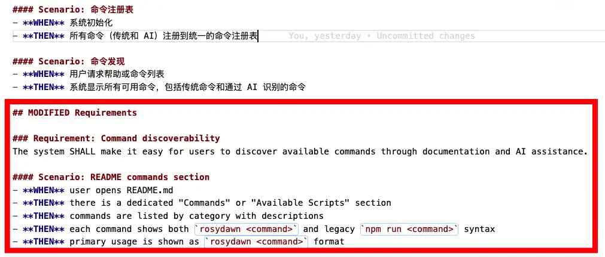

### Skills 系统

Skills 系统和命令行系统中的命令大多类似，这里不再赘述。感兴趣的话，可以初始化一个空项目，然后在对应 agent 的 skills 目录中查看对应内容。

以 `openspec-continue-change` 为例，除了 Skill 本身的格式要求，比如在 metadata 中定义什么时候使用 continue skill 等差异外，Skill 内容和 continue 命令内容绝大部分基本一致。

## OPSX 自定义工作流

如果说 0.x 是通过极简交互把人带进 SDD，那么 1.x 的核心思想是通过可编排的自定义工作流，让你在整个开发流程中拥有更多可能性。

### 多语言适配

多语言适配只需要在 `openspec/config.yaml` 文件中通过 `context` 指定语言即可：

```yaml
context: |
  语言：中文（简体）
  所有产出物必须用简体中文撰写。
```

### 自定义 Workflow

默认 SDD 工作流程如下：


我希望能够在整个工作流程中增加两个环节：

1. **测试用例生成**：结合需求内容和设计方案，产出详细测试执行 case 列表，方便功能测试。
2. **review 材料汇总**：结合前面所有材料，汇总成一份对人类友好的 review 材料。

新的工作流大致如下：

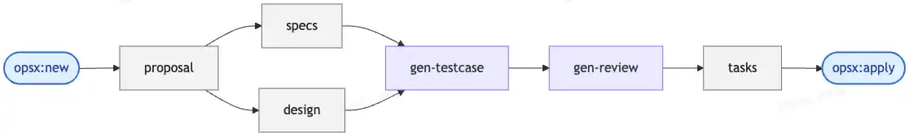

先基于已有 workflow fork 出一个新的 workflow：

```bash
openspec schema fork spec-driven rosydawn-sdd
```

之后会在项目的 `openspec/schemas` 目录下生成新的 schema：

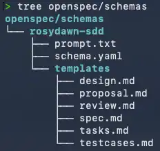

这里需要做两件事情：

1. 在 `templates` 中补充 `testcases.md` 和 `review.md` 模板。
2. 在 `schema.yaml` 中对工作流进行编排设计，按照 schema 规范描述新的 workflow DAG 依赖关系。

前面已经拆解过 proposal、specs、design、tasks 这些环节的提示词，这里不再赘述。对于新增工作流节点的模板和指令，可以结合自身诉求与 AI 来完成。

以我自定义的 `gen-review` 为例，它强调结合前面的 proposal、specs、design、tasks 等产物，综合提炼为一份人类友好的评审文档，方便评审人 review 整个需求的技术设计和实现。

```yaml
- id: gen-review
  generates: review.md
  description: Human-friendly summary of all materials for peer or stakeholder review
  template: review.md
  instruction: >
    Create a human-friendly review synthesis document.
    Your goal is to act as a bridge between the detailed technical artifacts
    (proposal, specs, design, testcases) and human reviewers
    (Product Managers, Tech Leads, QA).
    DO NOT just copy-paste from previous documents.
    Summarize, synthesize, and highlight the most important information.
    Sections:
    - TL;DR
    - Core Changes
    - Technical Highlights
    - Quality Assurance
    - Impact & Risks
    - Review Focus
    Tone: Professional, concise, and focused on readability.
  requires:
    - proposal
    - specs
    - design
    - gen-testcase
```

完成流程编排后，可以通过 validate 命令校验 schema 是否异常，比如是否出现环形依赖。OpenSpec 要求 workflow 的各个环节必须是有向无环图才能通过校验。

```bash
openspec schema validate rosydawn-sdd
```

如果有错误，OpenSpec 会提示具体错误，根据提示修正即可。

```text
openspec schema validate rosydawn-sdd
Note: Schema commands are experimental and may change.
✓ Schema 'rosydawn-sdd' is valid
```

应用自定义工作流也很直接：更改 `openspec/config.yaml` 中的 `schema` 即可。

## OPSX 项目实践

假期里我突然想到，过去使用 Hexo、Hugo 这些静态博客框架写博客的流程比较繁琐，如果部署到个人服务器上，流程也挺麻烦。因此我想做一个工具，能够在 CLI 中联动大模型，降低博客写作和发布的心智负担。

整个项目的迭代思路大概如下：

1. 通过 Vibe Coding 完成最简单的第一版。这个版本类似极简 MVP，能够通过基础 CLI 命令完成静态博客框架功能，并集成自动化部署、HTTPS 等能力。
2. 引入 OPSX 工作流，基于 SDD 渐进式迭代功能。一方面深度实践 SDD 开发流程，做一些小需求，比如网页样式迭代；另一方面也进行大功能开发和重构，比如大模型能力接入、重构 CLI 等，借此摸清真实需求开发场景下更好的 OpenSpec 使用方式。

### 需求修正闭环

过去我对 SDD 开发一直有一个疑问：整个需求开发完毕后，如果发现功能有问题，该如何修复？这个问题如何在 OpenSpec 中完成闭环？

我遇到的 case 是：将 PlantUML 图片从“构建时请求服务器”改为“构建时编码 URL + 浏览器延迟加载”。同时新增图片/源码切换功能，让用户可以查看原始 PlantUML 代码。这样做可以加速构建，同时解决构建过程中请求 PlantUML 服务失败导致图片无法渲染的问题。

整个需求实施完成后，我发现效果是这样的：

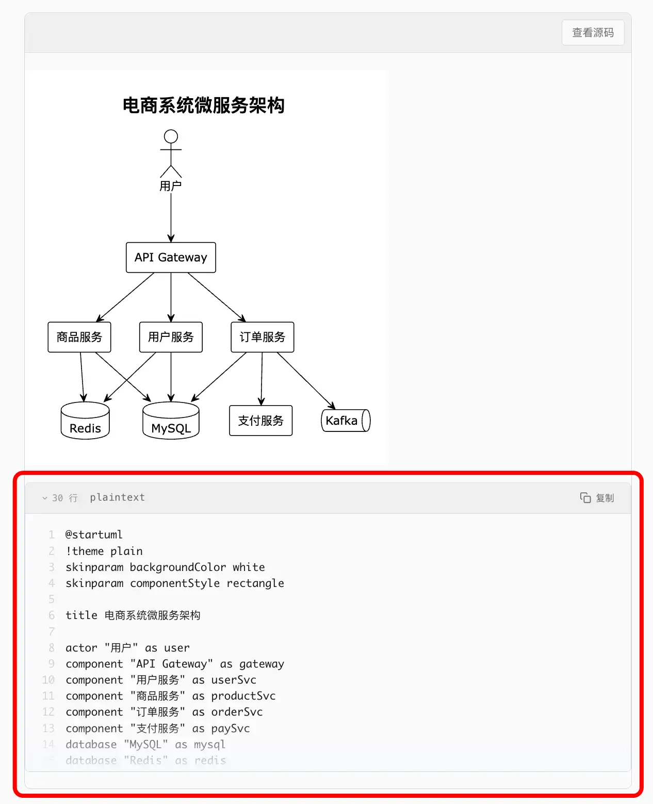

这和我的预期有差异。回头 review 需求的 `design.md` 后，我发现其实设计方案中已经能看到这个问题，只是我没有仔细审查文档。

这个需求已经进入尾声，此时一般有两种选择。

**场景 A：开发中或归档前修正。**

直接告诉大模型有哪些问题，让它进行返工。这里需要注意，如果没有触发 spec、design 等文档更新，可以直接问模型：以上修复是否需要更新到需求相关文档中？一般这会自动触发对应文档更新。

**场景 B：归档后修正。**

如果需求已经归档，则可以通过 OpenSpec 创建新的需求提案。这个过程中 agent 会让我们选择是 bugfix 还是新需求。你可以告诉模型过去做过的某个需求有哪些问题，甚至直接告诉它已归档需求文件夹名称。

模型通常会做几件事：

1. 找到已归档需求文件，查看相关内容来了解上下文。
2. 基于上下文创建新的变更提案，并在提案内说明 Modified Capabilities 涉及哪些 spec 变更。
3. 正常按照 OPSX 工作流生成产物并修复问题。
4. 完成修复并归档时，根据变更内容更新原始 spec，保障 spec 的时效性和准确性。

这个闭环让我意识到，OpenSpec 的 archive 不只是收纳旧文件。它让历史需求变成未来 bugfix 和二次迭代的上下文来源。

### 大需求实践：第一次失败

在项目完成到一定程度后，我希望把大模型能力引入 CLI 中。用一句话总结需求：

> 将所有脚手架流程接入 AI。用户可以通过脚手架语义化对话，完成文章创建、提交、部署等行为。收拢脚手架逻辑，不再通过 `npm run xxx` 运行，而是只需要执行一个 `rosydawn` 命令，剩下的通过和 AI 对话完成。

第一次尝试时，在经过多轮对话澄清需求后，OPSX 创建了 10 个 spec。

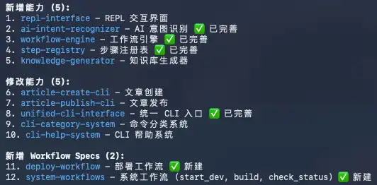

新增能力 4 个：

1. `ai-chat-interface`：AI 对话界面。
2. `semantic-command-parser`：语义化命令解析器。
3. `workflow-orchestrator`：工作流编排器。
4. `context-manager`：上下文管理器。

修改能力 6 个：

1. `unified-cli-interface`：扩展为 AI 对话模式。
2. `cli-category-system`：新增 AI 对话类别。
3. `cli-help-system`：支持 AI 辅助帮助。
4. `article-create-cli`：适配工作流编排。
5. `article-publish-cli`：适配工作流编排。
6. `ai-service-integration`：新增对话能力。

最终总共拆分出了 132 个 task。这确实是一个超级大的功能。当时我仍然按照 `/opsx:ff` 的方式一路手动往下 continue。最后我发现，这个需求开发失败了：效果完全不符合预期，模型生成了近一万行垃圾代码。

回头看，这个过程有几个问题。

**第一，spec 生成阶段没有人工严格 review。** 这导致后面的编码实现阶段，模型抓不住需求真正的重心。随着开发进度推进，误差越来越严重。SDD 中，spec 是整个工作流唯一的真理源。如果 spec 本身包含幻觉、逻辑断层等问题，后面基于这些 spec 生成的代码注定会成为灾难。

事实上，仅仅 spec 生成这一步，就能看到注意力坍缩。最初的 system prompt 和核心 context 已经约束了中文输出，但后续生成的一批 spec 有些是中文，有些是英文。连最简单的语言约束都无法稳定维持，说明核心业务逻辑约束的注意力权重早就被稀释得很低。

**第二，上下文窗口爆炸。** 大模型开始忽略 context 中的强约束。实际观察下来，最开始生成的一批 spec 能保持中文语言，后面则混杂中英文。这不是语言问题，而是上下文负荷过高后的明显信号。

**第三，长序列任务极容易产生误差累积。** 在庞大的 task 清单里，开头的 task 可能还比较精准，但随着任务推进，一旦某个环节出现偏差，后续依赖这个 task 的任务都会继续偏。越往后，误差累积带来的负面影响越大。

**第四，盲目采用一波流执行方式。** 不停地 continue，会让模型在高度耦合功能中逐步失控。比如某个具体功能点依赖前面 spec 中已经实现的底座能力，但中途测试发现底座根本调不通。我的自定义 workflow 中有 `gen-testcase` 用于生成测试 case，但超大需求生成出来的 testcase 很难即时执行。很多 case 必须等功能开发得差不多了才能验证。问题根源仍然是大需求下上下文负荷如滚雪球般爆炸，生成代码各自为战，最终无法跑通。

### 第二次尝试：核心是“拆”

从某种角度来看，第一次尝试失败的核心原因有两个：

1. **人的原因。** 表层原因是人工未能严格 review 所有材料，深层原因是人本身对复杂任务的认知和拆解不到位。这是机器无法弥补的。
2. **模型的原因。** 模型能力有限。它像一个开发能力很强，但大脑内存有限的工程师。

这两个问题都不在于 SDD 或 OpenSpec 本身。当求解的问题超出一定体量或复杂度后，人和模型都无法很好掌控。和多个模型讨论后，AI 给出的问题核心解法都是一个字：拆。将复杂问题分而治之，将复杂需求分而治之。

第二次尝试时，我重点探索两个方向：

1. 如何通过和 AI 对话，将需求澄清，并拆解成可分批次实现的子需求。
2. 第一步完成的需求拆解，如何落地到 OPSX 工作流中，也就是通过多个提案完成整体需求。

拆解的核心思想是：**分层 + 分批次实现**。

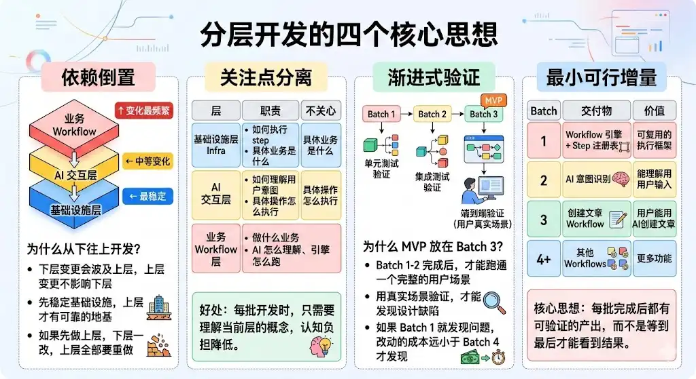

### 实施步骤

**第一步：需求澄清。**

为了避免需求不清晰影响后续产物质量，我首先通过 explore 命令和模型进行多轮会话，澄清整个需求。最原始的需求提示词仍然和第一次一致。

最开始仍然生成了 10 个 spec。在此之后，我额外补充一轮对话，让模型对已生成的 10 个 spec 进行 review、校验和优化，最终得到 12 个 spec。

**第二步：需求拆解。**

拆解阶段，我明确告诉模型：一次性完成这么多 spec 的开发，会严重超出上下文区间，导致效果很差。要求模型采用分层、分批开发策略，重新规划整个需求，将其拆分为多个 change 完成实现。

这一步只需要告诉模型先理解整个大的需求，再明确要求它按照分层分批次实施的方式，将原始需求拆解为多个 change。模型会完成原始 change 拆解。如下图所示，最终拆成了 5 个独立子 change：

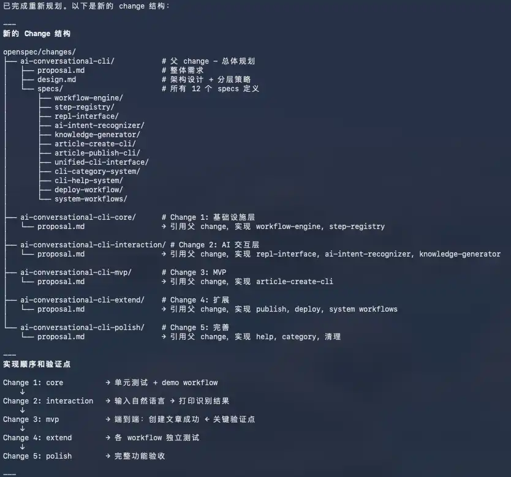

**第三步：需求开发。**

之后按照分层分批次的逻辑，依次针对每一个 change 进行开发：

```text
/opsx:continue <change-name>
```

这样做的好处是，每个子 change 都能有效控制上下文长度，保证执行效果；每个子 change 开发完毕后，都能进行独立单元测试和验证，确认无误后再进入下一个子 change。

当每个子 change 开发完毕后，极其建议及时通过 git 进行版本归档。如果后面的子 change 开发出现问题，就能及时回滚。

这对人也有两个好处：

- **认知减负。** 每次只 review 2-3 个 spec，人的审查能保持高专注度。
- **即时止损。** 每一批次完成后及时 git commit。如果 Batch 3 跑偏，回滚成本只限于当前批次，而不是把整个需求全部推倒重来。

**第四步：需求归档。**

在依次完成 5 个子 change 开发后，可以使用批量归档命令：

```text
/opsx:bulk-archive
```

agent 会自行查找当前哪些 change 可以归档。你只需要根据模型输出，勾选对应要归档的 change 即可。

完成所有子 change 归档后，最开始那个原始 change 可以直接移除。

## 总结：SDD 与 AI Coding 的几个思考

深入体验完整 Vibe Coding 和基于 OpenSpec 的 SDD 开发流后，我有几个新的判断。

### 1. 人是问题边界定义的终极锚点

问题的定义权永远在人手中。一个需求如果人没有想清楚，寄希望于模型去“发散”，本质上是一种抽卡式开发。强模型或许能靠概率击中目标，但对于稳定工程产出而言，我们不能把结果建立在运气之上。人必须提供清晰的问题定义，模型才能精准给出解决结果。

### 2. 人与 AI 对复杂问题的拆解能力，决定模型能力上限

面对复杂任务，AI 的注意力缺失和逻辑幻觉，是目前物理限制下的必然。“拆” 表面上是在解决上下文窗口爆炸的技术问题，深层看则是人与 AI 的合作约定：人需要将任务复杂度降维到模型能稳定掌控的区间，这是拿到正确结果的前提。

### 3. SDD 中 Spec 是开发者需要死守的质量底线

前面失败的实践给我的教训是：如果人放弃了对 spec 的严格审阅，SDD 就会迅速退化为一种“有文档的乱写代码”。Spec 不是流程上的累赘，而是工程中唯一的真理源。它是人对 AI 输出进行质量校验的最后一道关卡。守住 spec，就守住了项目质量下限。

随之而来的问题是：很少有人会严格 review 别人的代码，谁又能保证严格 review AI 生成的 spec 呢？

### 4. AI Coding 的工程节奏：分而治之，合而为一

OpenSpec 将不同 change 进行了物理隔离，使得我们可以充分对问题进行分解，分而治之。复杂大需求可以拆解为多个独立子 change，每个子 change 独立验证，从物理上隔绝上下文干扰；待单一功能点确认无误后，再通过 archive 将其精准合入主干规范。

基于这套流程，可以很好地将“一次性完成”的不可控，转化为“原子化增量构建”的可控。它既通过隔离解决长序列任务中的注意力坍塌，又通过有序合并保障复杂系统演进过程中的逻辑一致性。

AI Coding 时代，对人的要求不是降低了，而是拔高了。过去的经验里，架构师往往是经验最老练的那批人；而 AI Coding 要求，如果想获得更高质量的产出，初级工程师也必须掌握一些古法编程时代高级工程师基于经验积累出来的工作方法论。

## 参考资料

- [Fission-AI/OpenSpec GitHub Repository](https://github.com/Fission-AI/OpenSpec)
- [OpenSpec Concepts](https://github.com/Fission-AI/OpenSpec/blob/main/docs/concepts.md)
- [OpenSpec OPSX Workflow](https://github.com/Fission-AI/OpenSpec/blob/main/docs/opsx.md)
- [OpenSpec Workflows](https://github.com/Fission-AI/OpenSpec/blob/main/docs/workflows.md)
- [OpenSpec v1.4.1 Release](https://github.com/Fission-AI/OpenSpec/releases/tag/v1.4.1)
