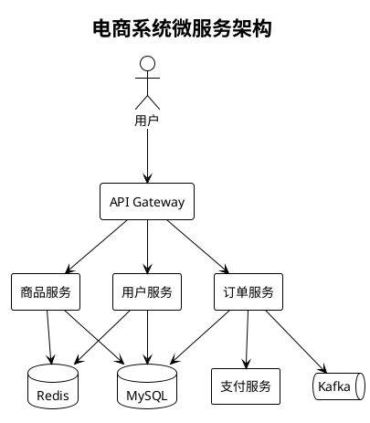
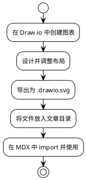

import deploymentArch from './deployment-arch.drawio.svg';

# 系统架构图绘制指南：PlantUML vs Draw.io 实战对比

在软件开发过程中，清晰的架构图是团队沟通的重要桥梁。本文将通过实际案例，对比 PlantUML 和 Draw.io 两种主流工具的优缺点。

## 为什么架构图很重要？

- **新人 Onboarding**：快速理解系统全貌
- **技术评审**：可视化方案便于讨论
- **文档沉淀**：代码会变，但架构思想需要传承
- **故障排查**：快速定位问题所在层级

## PlantUML：代码即图表

PlantUML 的核心理念是「代码即图表」，通过文本描述生成图形，天然适合版本控制。

### 示例：微服务调用链

### PlantUML 优势

1. **版本控制友好** - 纯文本，Git diff 一目了然
2. **自动布局** - 无需手动调整位置
3. **CI/CD 集成** - 可自动生成最新文档
4. **语法简洁** - 学习曲线平缓

## Draw.io：所见即所得

Draw.io 提供了更灵活的可视化编辑能力，适合复杂的、需要精细调整的图表。

### 示例：系统部署架构

下面是一个使用 Draw.io 绘制的云原生部署架构图（导出为 `.drawio.svg` 直接引用）：

> 💡 **最佳实践**：在 Draw.io 中绘制完成后，导出为 `.drawio.svg` 格式。这种格式既保留了可编辑性（用 Draw.io 打开仍可编辑），又可以作为普通 SVG 图片直接引用。

### Draw.io 优势

1. **所见即所得** - 直观的拖拽编辑体验
2. **丰富的图形库** - 各种云厂商、网络设备图标
3. **精细控制** - 像素级的位置调整
4. **多格式导出** - SVG、PNG、PDF 等
5. **图文合一** - `.drawio.svg` 既可编辑又可展示

## 对比总结

| 维度 | PlantUML | Draw.io |
|------|----------|---------|
| 学习曲线 | 中等（需学习语法） | 低（可视化操作） |
| 版本控制 | ⭐⭐⭐⭐⭐ 优秀 | ⭐⭐⭐⭐ 良好（SVG 可 diff） |
| 自动布局 | ✅ 自动 | ❌ 手动 |
| 样式灵活性 | ⭐⭐⭐ 有限 | ⭐⭐⭐⭐⭐ 极高 |
| 团队协作 | Git + MR | Git + MR（.drawio.svg） |
| CI 集成 | ⭐⭐⭐⭐⭐ 原生支持 | ⭐⭐⭐⭐ 无需处理 |
| 是否需要插件 | 需要 remark 插件 | 无需插件，原生图片 |

## 最佳实践建议

### 选择 PlantUML 的场景

- 时序图、类图等 UML 标准图
- 需要频繁更新的活文档
- 强调「文档即代码」的团队

### 选择 Draw.io 的场景

- 复杂的网络拓扑图
- 需要品牌色彩的对外文档
- 一次性的架构汇报材料
- 需要精细控制布局的场景

## Draw.io 工作流

推荐的 Draw.io 使用流程：

## 混合使用策略

在实际项目中，我们推荐混合使用：

| 文档类型 | 推荐工具 | 原因 |
|---------|---------|------|
| API 时序图 | PlantUML | 代码驱动，易于维护 |
| 类图/ER 图 | PlantUML | 自动布局，关系清晰 |
| 部署架构图 | Draw.io | 需要精细布局和云图标 |
| 网络拓扑图 | Draw.io | 复杂连线，自定义样式 |
| 流程图 | 两者皆可 | 根据复杂度选择 |

## 总结

没有最好的工具，只有最适合的场景。理解每种工具的特点，根据实际需求灵活选择，才能最大化团队效率。

**核心建议**：
- **PlantUML** 用于代码驱动的 UML 图表
- **Draw.io + .drawio.svg** 用于需要精细控制的架构图