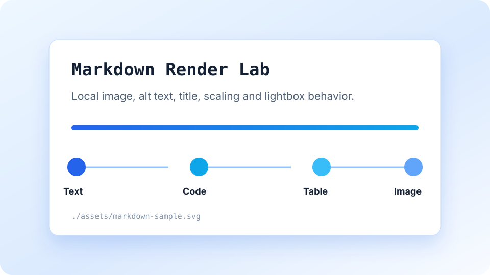
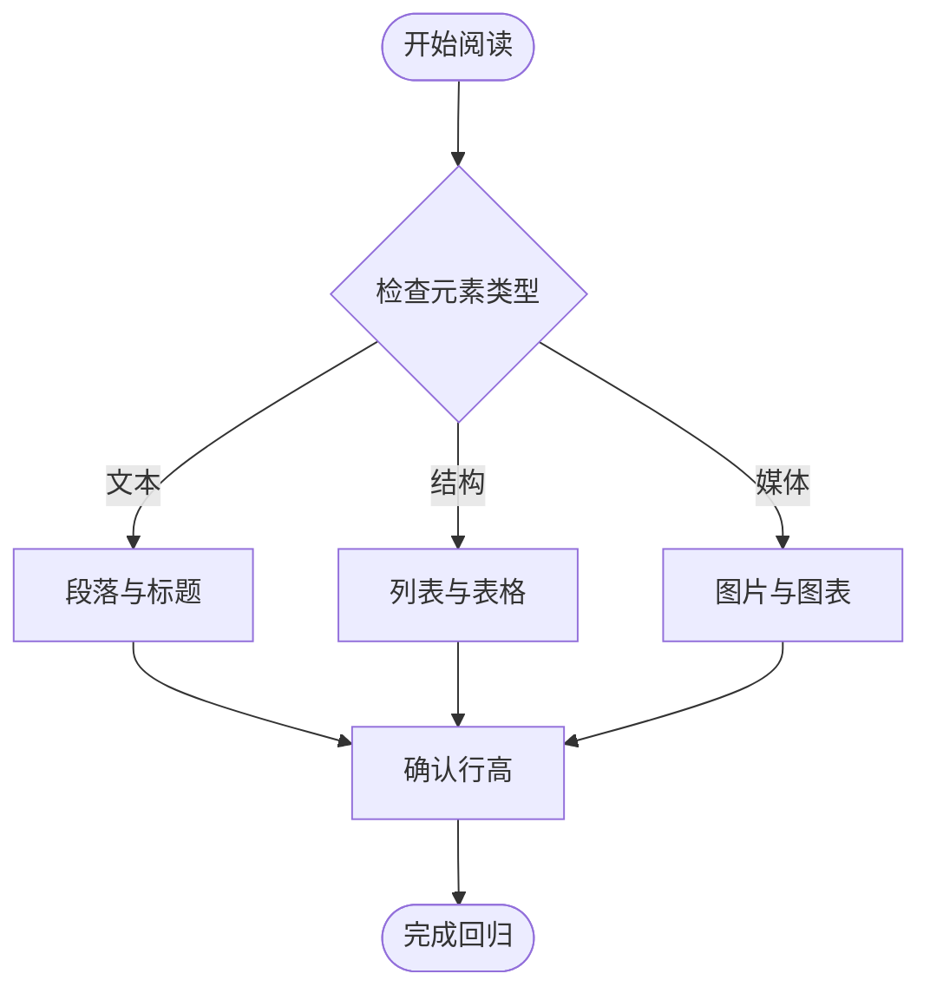
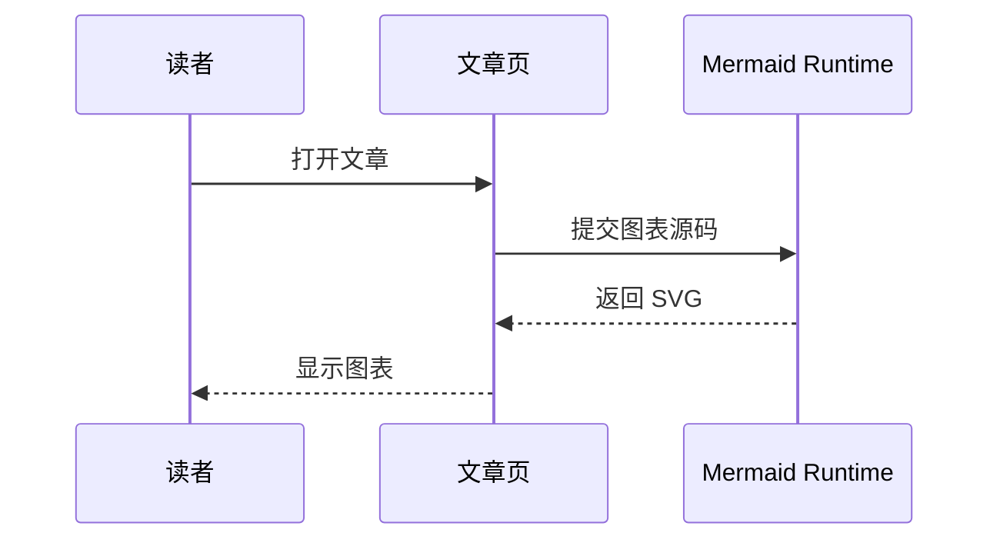

这是一篇专门用于检查博客正文渲染效果的长文章。它不追求观点完整，而是把常见 Markdown 和 GFM 语法集中放在同一个页面里，方便观察字号、行高、间距、颜色、代码块、图片、表格、目录、脚注和图表在真实长文中的表现。

阅读时可以重点检查几个问题：普通段落是否耐读，列表是否容易扫描，代码块是否清晰，图片是否可以放大，表格是否拥挤，Mermaid 是否能从源码渲染为图表，右侧目录是否能稳定定位到章节。

# 正文一级标题测试

正文里通常不会再使用一级标题，因为文章页顶部已经有主标题。但为了检查浏览器默认样式和站点样式的边界，这里保留一个正文中的一级标题。它应该比二级标题更醒目，但不能破坏页面节奏。

## 1. 段落、换行与基础文本

普通段落是长文最重要的元素。这里放一段相对长的中文文本，用来检查当前 `16px / 24px` 的正文节奏是否合适。技术文章经常会混入 `inline code`、英文短语、路径、命令和参数名，例如 `src/content/posts`、`npm run build`、`ASTRO_ENV=production`。这些片段不能让行高显得跳跃，也不能让段落颜色变得过重。

Markdown 的单个换行通常不会生成新的段落。
这一行和上一行在源码中相邻，但渲染后应该仍然属于同一个段落。

如果需要显式换行，可以在行尾保留两个空格。  
这一行应该紧跟上一行显示，但不是新的段落块。

下面是一组基础行内样式：**加粗文本**、*斜体文本*、***加粗斜体***、~~删除线~~、`inline code`、[站内链接](/about)、[带标题的站外链接](https://example.com "Example Domain")、自动链接 <https://example.com>、邮箱样式 <hello@example.com>。

还需要检查 HTML 实体和特殊字符：`&amp;` 应显示为 &amp;，`&lt;section&gt;` 应显示为 &lt;section&gt;，反斜杠转义可以让 \*星号\* 保持为普通字符。

## 2. 标题层级

标题承担文章骨架。右侧目录只收集二级和三级标题，所以这一节下面会连续放几个层级，用来检查目录、滚动定位和正文视觉层级。

### 2.1 三级标题

三级标题用于解释当前二级章节内部的局部主题。它应该明显弱于二级标题，但仍然能在快速滚动时被识别。

#### 2.1.1 四级标题

四级标题在技术文档里常用于参数组、注意事项或局部规则。它不进入右侧目录，但应该仍然有足够的字重和间距。

##### 2.1.1.1 五级标题

五级标题使用频率很低。测试它的意义主要是确认默认样式不会突然变得过小或过轻。

###### 2.1.1.1.1 六级标题

六级标题是 Markdown 标题层级的末端。真实文章里应该慎用，但渲染层仍需要稳定。

## 3. 无序列表

无序列表常用于技术要点、检查清单和分组说明。下面的列表包含短句、长句和嵌套层级：

- 第一项是短句，用来检查项目符号和文字之间的距离。
- 第二项包含一段较长说明：当列表项内容跨行时，第二行应该和第一行的文字对齐，而不是回到项目符号下面。
- 第三项包含行内代码 `renderMermaidDiagrams()` 和一个路径 `src/layouts/Layout.astro`。
- 第四项包含嵌套列表：
  - 嵌套项 A：检查缩进是否足够清楚。
  - 嵌套项 B：检查上下间距是否过大。
  - 嵌套项 C：继续嵌套一层。
    - 第三层缩进不应该过度内收。
    - 第三层项目符号不应该抢正文视觉权重。
- 第五项包含链接：[返回首页](/)。

## 4. 有序列表

有序列表用于步骤说明。它需要保持编号对齐，并且在多位数字后仍然稳定。

1. 打开文章详情页。
2. 检查正文段落的行高和宽度。
3. 滚动页面，观察顶部标题栏是否保持吸顶。
4. 展开或收起右侧目录，刷新页面后确认状态是否保持。
5. 点击图片，确认图片预览和缩放操作是否可用。
6. 切换主题，确认代码高亮、Mermaid 图表和表格边框是否同步变化。
7. 跳转到另一篇文章，确认目录缓存仍然生效。
8. 回到本页，确认 Mermaid 不会停留在 loading 状态。
9. 继续滚动到脚注和内联 HTML 区域。
10. 最后运行构建，确认静态输出不报错。

## 5. 任务列表

任务列表属于 GFM 语法。它适合表示检查项，但在博客正文里不应该显得像表单控件。

- [x] 普通段落渲染正常
- [x] 表格渲染正常
- [x] 代码块显示语言标签和复制按钮
- [ ] 手动检查暗色主题下的图片背景
- [ ] 手动检查移动端目录是否隐藏
- [ ] 手动检查长代码块折叠按钮

## 6. 引用块

引用块用于突出外部文本、原则、警告或补充说明。它应该有明确边界，但不能像卡片一样过重。

> 这是一个普通引用。引用中的文字应该保持正文可读性，左侧边线提供结构提示即可。

> 这是一个多段引用。
>
> 第二段引用文本用于检查段落之间的距离。引用内部的段落不应该粘在一起，也不应该像两个完全独立的模块。

> 嵌套引用第一层。
>
> > 嵌套引用第二层。真实文章里很少需要这么写，但它可以暴露引用边距和颜色是否过度叠加。

## 7. 表格

表格用于展示结构化信息。下面这个表格包含左对齐、居中、右对齐、行内代码和较长描述。

| 类型 | 状态 | 示例 | 说明 |
| :--- | :---: | ---: | --- |
| 段落 | 通过 | 12 | 中文长段落应该保持稳定的行高。 |
| 链接 | 通过 | 8 | 链接需要有明确提示，但不要让整段文字变蓝。 |
| 代码 | 通过 | 16 | `inline code` 和代码块需要区分层级。 |
| 图片 | 待检查 | 3 | 普通图片、SVG 图片和内联 SVG 都需要确认。 |
| 表格 | 通过 | 5 | 边框、斑马纹和单元格 padding 需要保持克制。 |

再放一个更偏实际的参数表：

| 字段 | 类型 | 是否必填 | 默认值 | 备注 |
| --- | --- | --- | --- | --- |
| `title` | `string` | 是 | 无 | 文章标题，显示在详情页顶部。 |
| `date` | `Date` | 是 | 无 | 用于排序和展示。 |
| `description` | `string` | 是 | 无 | 用于首页列表和文章头部摘要。 |
| `tags` | `string[]` | 否 | `[]` | 用于标签页聚合。 |
| `coverImage` | `Image` | 否 | 无 | 当前测试文章不使用封面图。 |

## 8. 代码块

代码块是技术博客最重要的非正文元素之一。它需要支持语法高亮、横向滚动、复制按钮、语言标签和长代码折叠。

### 8.1 Bash

```bash
git status --short
npm run build
npm run dev -- --host 127.0.0.1 --port 18080
curl -I http://127.0.0.1:18080/blog/2026/06/markdown-rendering-lab
```

### 8.2 TypeScript

```ts
type RenderState = 'idle' | 'loading' | 'rendered' | 'error';

interface DiagramJob {
  id: string;
  source: string;
  theme: 'default' | 'dark';
  state: RenderState;
}

function shouldRender(job: DiagramJob, currentTheme: DiagramJob['theme']) {
  if (job.state === 'loading') return false;
  if (job.state === 'error') return true;
  return job.theme !== currentTheme;
}

const job: DiagramJob = {
  id: 'markdown-rendering-lab',
  source: 'flowchart LR\\nA-->B',
  theme: 'default',
  state: 'idle',
};

console.log(shouldRender(job, 'dark'));
```

### 8.3 Go

```go
package main

import (
	"fmt"
	"net/http"
	"time"
)

func main() {
	server := &http.Server{
		Addr:              ":18080",
		ReadHeaderTimeout: 3 * time.Second,
	}

	http.HandleFunc("/healthz", func(w http.ResponseWriter, r *http.Request) {
		fmt.Fprintln(w, "ok")
	})

	if err := server.ListenAndServe(); err != nil && err != http.ErrServerClosed {
		panic(err)
	}
}
```

### 8.4 JSON

```json
{
  "name": "markdown-rendering-lab",
  "checks": {
    "paragraph": true,
    "table": true,
    "image": true,
    "code": true,
    "mermaid": true
  },
  "viewport": {
    "desktop": "1280x720",
    "mobile": "390x844"
  }
}
```

### 8.5 Diff

```diff
- line-height: 1.7;
- font-size: 0.925rem;
+ line-height: 24px;
+ font-size: 16px;
```

### 8.6 长代码块

下面的代码块故意超过 15 行，用来检查长代码块是否出现折叠控制。

```ts
const checklist = [
  'title',
  'paragraph',
  'strong',
  'emphasis',
  'delete',
  'inline-code',
  'link',
  'unordered-list',
  'ordered-list',
  'task-list',
  'blockquote',
  'table',
  'code-block',
  'long-code-block',
  'image',
  'html',
  'mermaid',
  'footnote',
  'horizontal-rule',
  'toc',
  'sticky-header',
  'local-storage',
];

for (const item of checklist) {
  console.log(`[markdown-rendering-lab] ${item}`);
}
```

## 9. 图片

下面是普通 Markdown 图片语法，图片来自本文同目录下的本地 `assets`。它应该跟随正文宽度自适应，点击后可以进入图片预览。



图片后面继续接普通段落，用来检查图片上下间距是否自然。图片不应该像卡片一样浮起，也不应该贴着上下文。

下面是 HTML 形式的图片和说明文字，用来检查 Markdown 中的原生 HTML 块：

<figure>
  
  <figcaption>HTML figure caption：这行文字用于观察图注的默认排版。</figcaption>
</figure>

## 10. Mermaid 图表

Mermaid 代码块会在构建阶段保留源码，浏览器加载后再渲染为 SVG。这个章节可以验证运行时渲染、主题切换和错误兜底。



再放一个时序图，检查多图表场景：



## 11. Draw.io 风格内联 SVG

下面这个 SVG 带有 `content="mxfile ..."` 属性，用来触发站点里对 Draw.io SVG 的增强逻辑。预期效果是文字不能被选中，并且点击后可以像普通图片一样放大查看。

<svg xmlns="http://www.w3.org/2000/svg" width="720" height="260" viewBox="0 0 720 260" content="mxfile markdown-rendering-lab" role="img" aria-label="Draw.io style SVG sample">
  <rect x="20" y="20" width="680" height="220" rx="12" fill="#ffffff" stroke="#bfdbfe"/>
  <rect x="70" y="88" width="150" height="70" rx="8" fill="#dbeafe" stroke="#2563eb"/>
  <rect x="285" y="88" width="150" height="70" rx="8" fill="#e0f2fe" stroke="#0ea5e9"/>
  <rect x="500" y="88" width="150" height="70" rx="8" fill="#eff6ff" stroke="#60a5fa"/>
  <path d="M220 123H285" stroke="#2563eb" stroke-width="3" marker-end="url(#arrow)"/>
  <path d="M435 123H500" stroke="#2563eb" stroke-width="3" marker-end="url(#arrow)"/>
  <defs>
    <marker id="arrow" markerWidth="10" markerHeight="10" refX="8" refY="3" orient="auto" markerUnits="strokeWidth">
      <path d="M0,0 L0,6 L9,3 z" fill="#2563eb"/>
    </marker>
  </defs>
  <text x="145" y="117" text-anchor="middle" fill="#142033" font-size="18" font-family="-apple-system, BlinkMacSystemFont, Segoe UI, sans-serif" font-weight="700">Markdown</text>
  <text x="145" y="143" text-anchor="middle" fill="#506176" font-size="14" font-family="-apple-system, BlinkMacSystemFont, Segoe UI, sans-serif">source</text>
  <text x="360" y="117" text-anchor="middle" fill="#142033" font-size="18" font-family="-apple-system, BlinkMacSystemFont, Segoe UI, sans-serif" font-weight="700">Astro</text>
  <text x="360" y="143" text-anchor="middle" fill="#506176" font-size="14" font-family="-apple-system, BlinkMacSystemFont, Segoe UI, sans-serif">render</text>
  <text x="575" y="117" text-anchor="middle" fill="#142033" font-size="18" font-family="-apple-system, BlinkMacSystemFont, Segoe UI, sans-serif" font-weight="700">Browser</text>
  <text x="575" y="143" text-anchor="middle" fill="#506176" font-size="14" font-family="-apple-system, BlinkMacSystemFont, Segoe UI, sans-serif">enhance</text>
</svg>

## 12. 内联 HTML

Markdown 中偶尔需要少量 HTML。下面这些元素用于检查浏览器默认样式与站点样式是否协调。

<p><mark>mark 高亮文本</mark> 应该可见但不能过于刺眼。</p>

<p>键盘提示：按 <kbd>Command</kbd> + <kbd>K</kbd> 可以作为一个常见快捷键样式示例。</p>

<p><abbr title="HyperText Markup Language">HTML</abbr> 缩写应该保留浏览器默认提示。</p>

<details>
  <summary>展开更多测试说明</summary>
  <p>这是 details 内部的段落。它用于检查折叠区域在正文中的默认边距和可读性。</p>
  <ul>
    <li>第一条补充说明。</li>
    <li>第二条补充说明。</li>
  </ul>
</details>

## 13. 脚注

脚注适合放补充信息，不应该打断正文。这里引用一个脚注[^layout-note]，再引用第二个脚注[^render-note]。脚注区域通常出现在文章底部，用来检查正文和补充说明之间的层级。

[^layout-note]: 这条脚注用于解释排版测试：真正要观察的是连续阅读时的节奏，而不是单个元素的孤立样式。
[^render-note]: 这条脚注用于解释渲染测试：如果某个元素没有按预期显示，应先判断是 Markdown 语法支持问题、Astro 构建问题，还是浏览器端增强脚本问题。

## 14. 分隔线

分隔线用于强制切开上下文，但不应该滥用。下面是一条水平分隔线：

---

分隔线之后的段落用于确认上下间距是否足够，但不要造成页面被切成卡片的感觉。

## 15. 综合阅读段落

最后放一段接近真实文章的长文本。一个技术博客页面是否舒服，往往不是由某一个组件决定，而是由所有元素之间的密度决定。标题给出章节边界，段落提供主叙事，列表帮助扫描，代码块承载可执行细节，表格负责对比，图片和图表解释结构，脚注收纳补充说明。任何一个元素过重，页面都会失去平衡；任何一个元素过轻，读者又会缺少足够的视觉锚点。

因此，这篇测试文章应该在每次调整正文样式后重新打开。不要只看首屏，也不要只看短段落。真正需要检查的是滚动过程中的连续体验：从标题到段落，从段落到列表，从列表到代码，从代码到图片，再从图表回到正文时，读者是否仍然知道自己在哪里。

## 16. 回归检查清单

完成样式调整后，可以按下面的顺序检查：

1. 首页列表中这篇文章的标题、摘要、标签和日期是否正常。
2. 详情页标题区是否稳定，吸顶导航是否不改变高度。
3. 右侧目录是否展示二级和三级标题，并支持展开收起缓存。
4. Mermaid 图表是否完成渲染，不停留在 loading。
5. 本地 SVG 图片是否能显示、点击和缩放。
6. Draw.io 风格内联 SVG 是否不能选中文字，并能点击放大。
7. 代码块是否有语言标签、复制按钮和长代码折叠。
8. 表格在浅色和暗色主题下是否都清晰。
9. 任务列表、脚注、删除线和自动链接是否按 GFM 预期渲染。
10. 移动端正文是否没有横向溢出。

如果以上检查都通过，这篇文章就可以作为之后博客排版调整的固定回归样本。
